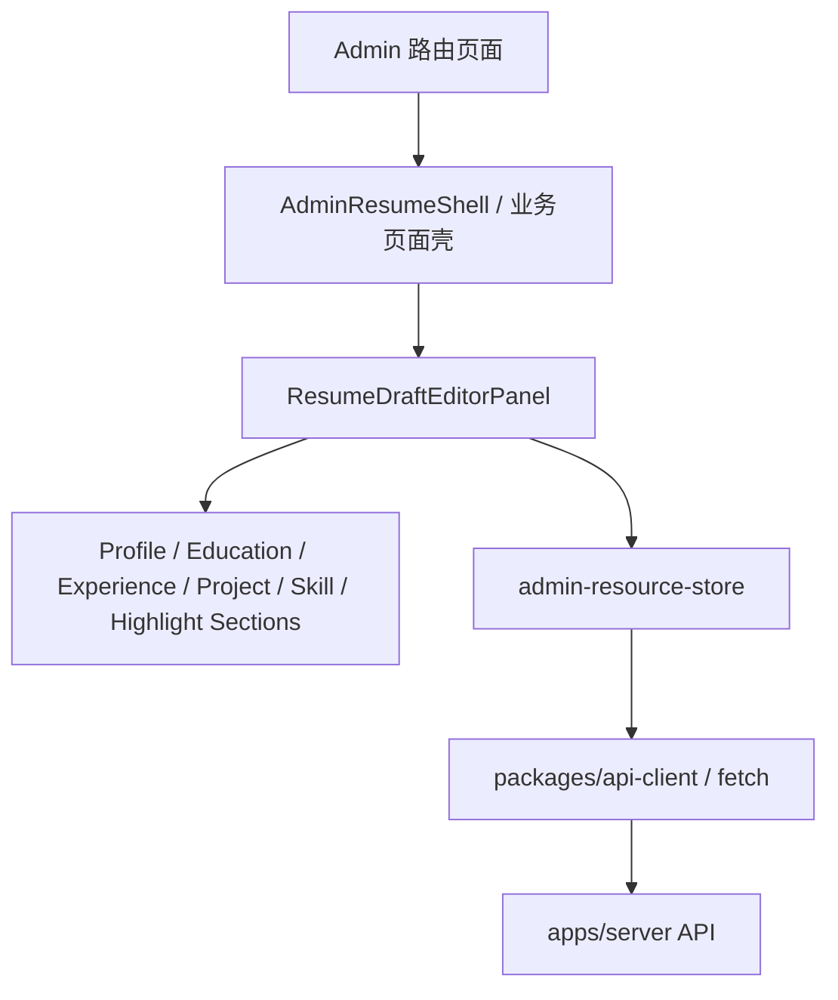
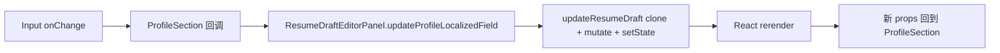

# my-resume：admin 后台前端与简历编辑链路

## 一、这份文档现在要讲什么

这份文档专门用来沉淀 `apps/admin` 这条前端线的源码理解。

当前重点先收三件事：

1. 后台前端壳如何与 `apps/server` 交互
2. 简历编辑器 `ResumeDraftEditorPanel` 的前端结构
3. 一个字段修改、拖拽排序、保存提交时，React 侧到底发生了什么

## 二、先给总图

一句话总结：

> `admin` 当前不是“自己持久化”，而是“页面壳 + 前端状态 + 资源缓存 + 调 `apps/server` API”。

## 三、后台前端壳是怎么立起来的

### 1. 登录页入口

- `apps/admin/app/page.tsx`
- `apps/admin/components/admin/login-shell.tsx`

这里的职责是：

- 展示登录页
- 调 `/auth/login`
- 将返回的 `accessToken` 存到 `localStorage`
- 再跳转到 `/dashboard`

### 2. dashboard 受保护壳

- `apps/admin/app/dashboard/layout.tsx`
- `apps/admin/lib/admin-session.tsx`
- `apps/admin/components/admin/protected-layout.tsx`

这里做的是：

- 进入 dashboard 时先读取本地 token
- 通过 `/auth/me` 校验当前登录态
- 把当前用户与角色能力放进 React Context
- 再交给各个后台工作区消费

### 3. 当前会话与资源缓存

最新代码里已经不只是“组件里直接 fetch”，而是增加了两层缓存：

- `apps/admin/lib/admin-session-store.ts`
  - 负责当前用户会话缓存
- `apps/admin/lib/admin-resource-store.ts`
  - 负责草稿、summary、AI runtime、缓存报告等资源缓存

这让后台进入了一种更稳定的资源读取模式：

- 同一资源可复用
- 同一 promise 可复用
- 保存后可以显式失效并刷新

## 四、`ResumeDraftEditorPanel` 到底是什么

核心文件：

- `apps/admin/components/resume/draft-editor-panel.tsx`

这个组件不是普通表单，而是当前后台简历编辑器的“状态中枢”。

它集中管理：

- 草稿加载
- 草稿本地副本
- 中英文双工作区
- 多模块编辑
- 拖拽排序
- 新增删除
- 保存提交
- 错误与反馈提示

也就是说：

> `ResumeDraftEditorPanel` 更像一个“编辑器容器”，而不是一组简单输入框。

## 五、编辑器当前最关键的状态

### 1. `draftSnapshot`

- 服务端返回的草稿快照

### 2. `resumeDraft`

- 当前浏览器里正在编辑的完整简历对象

### 3. `draftFieldValues`

- 专门给复杂输入框准备的字符串缓存层
- 例如：
  - `highlights[]`
  - `technologies[]`
  - `keywords[]`
  - `hero.slogans[]`

### 4. `sortableCollections`

- 专门给拖拽排序使用的前端 ID 序列
- 与真正的业务数组分开维护

### 5. `editorLocaleMode`

- 当前是 `zh` 中文主编辑
- 还是 `en` 英文翻译工作区

## 六、为什么既有 `draftSnapshot`，又有 `resumeDraft`

因为当前前端采用的是：

- 服务端快照
- 前端工作副本

两层结构。

即：

1. 先从服务端取一份 `draftSnapshot`
2. 再 clone 一份到 `resumeDraft`
3. 用户改的是 `resumeDraft`
4. 保存时再提交回服务端

这样做的好处是：

- 不会把输入中的临时状态直接污染远端
- 更适合大表单
- 更适合做撤销、校验、错误恢复与后续扩展

## 七、为什么还要有 `draftFieldValues`

因为后端与领域模型里很多字段是结构化的：

- `LocalizedText[]`
- `string[]`

但输入框更适合直接编辑字符串。

例如：

- 技术栈在 UI 中更适合写成逗号分隔字符串
- 亮点更适合写成多行文本

所以当前前端做了一层“模型 ↔ 表单字符串”转换。

相关 helper 在：

- `apps/admin/components/resume/draft-editor-helpers.ts`

这是当前简历编辑器非常重要的一层抽象。

## 八、当前编辑器的组件分层

### 1. 页面壳层

- `apps/admin/components/admin/resume-shell.tsx`

负责：

- 接 `accessToken`
- 判断是否可编辑
- 懒加载真正编辑器

### 2. 编辑器容器层

- `apps/admin/components/resume/draft-editor-panel.tsx`

负责：

- 管理全部核心状态
- 组织所有子模块
- 统一提交保存

### 3. 模块层

- `profile-section.tsx`
- `education-section.tsx`
- `experiences-section.tsx`
- `projects-section.tsx`
- `skills-highlights-sections.tsx`

负责：

- 各模块的 UI 展示
- 根据父组件传入的数据与回调进行工作

### 4. 原子组件层

- `editor-primitives.tsx`

负责：

- `LocalizedEditorField`
- `SortableItemShell`
- `EditorSection`
- `EditorEntry`
- `IconActionButton`

这让编辑器内部的样式与交互更统一，也更容易继续拆分演进。

## 九、A：从 `ProfileSection` 看一个字段是怎样从 UI 走到 state 的

这里以“姓名”字段为例。

### 1. `ProfileSection` 只是吃 props 的展示模块

- `apps/admin/components/resume/profile-section.tsx`

例如“姓名”字段使用：

- `LocalizedEditorField`
- 当前值来自 `resumeDraft.profile.fullName[editorLocaleMode]`
- 修改时调用 `updateProfileLocalizedField(...)`

也就是说，`ProfileSection` 自己不持有主状态，它只：

- 展示
- 触发回调

### 2. 回调回到 `ResumeDraftEditorPanel`

对应函数：

- `updateProfileLocalizedField()`

它内部调用：

- `updateResumeDraft()`

真正的更新流程是：

1. clone 当前 `resumeDraft`
2. 在新对象上改值
3. `setResumeDraft(nextDraft)`
4. React 重新渲染

### 3. React 重新渲染后，值再回到 `ProfileSection`

新的 `resumeDraft` 作为 props 再传回去：

- `ProfileSection`
- `LocalizedEditorField`

输入框显示的就是最新值。

这就是 React 最典型的“单向数据流”：

## 十、拖拽排序为什么要维护两套状态

拖拽排序用的是：

- `dnd-kit`

当前前端并没有直接拿业务数组当拖拽 ID，而是额外维护：

- `sortableCollections`

原因是：

- 拖拽库更适合消费稳定 ID
- 业务数据对象本身不适合直接承担拖拽交互身份

所以当前结构是：

- `resumeDraft.experiences`：真正业务数据
- `sortableCollections.experiences`：拖拽交互顺序

拖拽结束时，再同时重排：

- 前端交互 ID
- 真实业务数组

## 十一、保存草稿时前端做了什么

提交入口：

- `handleSubmit()`

当前流程：

1. 阻止浏览器默认提交
2. 确认当前已有 `draftSnapshot` 和 `resumeDraft`
3. 设置 `pendingSave = true`
4. 调 `saveDraft(...)`
5. 成功后：
   - 失效草稿缓存
   - 用服务端返回值更新 `draftSnapshot`
   - 用服务端返回值重建 `resumeDraft`
   - 重建 `draftFieldValues`
   - 重建 `sortableCollections`
6. 最后提示“草稿已保存，但公开站不会自动变化”

这说明前端当前保存策略是：

> 不是“假设自己保存成功”，而是明确以服务端返回结果为准，再同步本地状态。

## 十二、这一页最值得学的前端思想

如果你是从 React / Next 的学习角度来看，这一页最值得抓住的是：

1. 大组件不是问题，关键是状态与职责有没有分层
2. 表单状态和领域模型可以分两层维护
3. 拖拽交互状态和业务数据状态最好分离
4. 子组件不一定要持有状态，很多时候“父组件持有 + 子组件回调”更清楚
5. 资源缓存层可以显著改善后台体验，不必每个组件都直接裸 fetch

## 十三、后续可继续补的主题

- 逐行走读 `ProfileSection`
- 逐行走读 `EducationSection / ExperiencesSection`
- `dynamic import` 在 admin 中的作用
- `resource store / session store` 为什么值得保留
- AI 工作台如何复用相同的前端资源层模式
