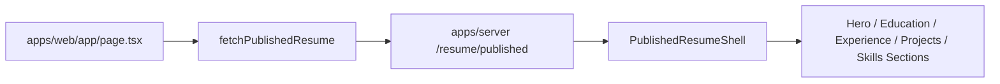

# my-resume：web 公开站渲染链路

## 一、这份文档现在记录什么

这份文档专门记录 `apps/web` 这条公开站前端线的源码理解。

当前先收基础总览，后续再继续细拆。

## 二、当前公开站的基本职责

`apps/web` 当前只做三件事：

1. 读取 `apps/server` 提供的已发布简历
2. 将已发布简历渲染为公开站页面
3. 提供主题、语言与导出入口相关的展示层交互

它不承担：

- 业务后端职责
- 草稿编辑
- AI 真正执行链路

## 三、公开站的基本数据流

## 四、当前入口结构

### 1. 页面入口

- `apps/web/app/page.tsx`

负责：

- 读取 API base URL
- 请求 `fetchPublishedResume()`
- 把结果传给 `PublishedResumeShell`

### 2. 页面外壳

- `apps/web/app/layout.tsx`

负责：

- 全局样式
- 主题初始化脚本
- `ThemeModeProvider`

### 3. 主展示壳

- `apps/web/components/published-resume/shell.tsx`

负责：

- 接收已发布简历
- 维护当前展示语言 `locale`
- 按模块拆给 hero / education / experience / projects / skills 等组件

### 4. 模块展示组件

- `published-resume-hero.tsx`
- `published-resume-education-section.tsx`
- `published-resume-experience-section.tsx`
- `published-resume-projects-section.tsx`
- `published-resume-skills-section.tsx`

这些组件主要负责“根据 props 纯渲染”。

## 五、当前这条线最重要的边界

当前公开站读取的是：

- 已发布版本

而不是：

- 草稿版本

所以它和 `admin` 的关系是：

- `admin` 维护 draft
- `server` 在 publish 时创建发布快照
- `web` 始终读取发布快照

这就是公开站与后台编辑页当前最重要的边界。

## 六、后续继续补的主题

- `PublishedResumeShell` 如何组织模块渲染
- `summary` 与 `full snapshot` 在前端视图中的区别
- `Hero / Header / locale` 如何协作
- 公开站为什么继续保持“展示壳”而不是承担业务逻辑
