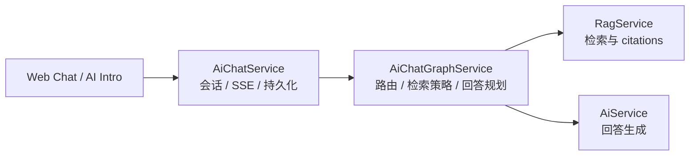
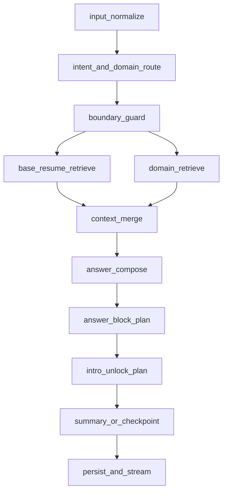

# AI Intro 与 LangGraph 多域 RAG 架构决策草案

> 状态：草案  
> 背景：M23 已完成公开站全局 AI Chat Drawer、RAG 问答、引用 Tooltip、基础治理闭环。下一阶段希望把 AI Chat 从“问答窗口”升级为更有前端表现力、更能体现个人画像的交互体验。

## 1. 本轮要解决什么

当前公开站 AI Chat 已经能完成基础问答，但仍然偏“你问我答”的传统聊天体验。接下来希望沿两条方向继续演进：

- 增加独立的 AI Intro 页面，用引导式预设问题和渐进解锁视觉，帮助访客更有层次地了解候选人。
- 引入 LangGraph 风格的多域路由检索，让不同问题进入不同知识域，提高 RAG 召回质量，并为 AGUI 风格的结构化卡片展示提供稳定输入。

这不是替换现有 Chat Drawer，而是在已有闭环上长出两个新能力：一个偏前端体验，一个偏检索与编排质量。

## 2. 保留现有能力边界

### 2.1 头像入口继续作为 Quick Ask

现有 web 端头像触发的全局 AI Chat Drawer 继续保留，定位为 Quick Ask：

- 任意公开站页面都可以打开。
- 允许自由提问。
- 继续复用现有会话、SSE、citation tooltip、RAG 问答和边界控制。
- 后续只接入更好的回答编排与 block 渲染，不改成引导页主入口。

### 2.2 新增 AI Intro 独立页面

新增一个独立页面承载更强的体验表达，建议路由为：

- `/{locale}/ai-talk/intro`

也可以先复用或改造现有 `resume-advisor` route shell，但产品定位要独立于 Quick Ask。

AI Intro 页面首版采用：

- 左侧：大聊天窗口。
- 右侧：人物画像 / 技能地图 / 拼图解锁区。
- 问题来源：预设问题，首版不开放自由输入。
- 交互节奏：每完成一个问题，右侧解锁一个主题碎片。

## 3. AI Intro MVP 决策

### 3.1 先做 10 块拼图解锁，不先做复杂技能树

右侧视觉有几种方向：战争迷雾、套装收集、技能树、人物拼图。首版建议采用“10 块拼图解锁”：

- 规则简单，和 10 个预设问题天然对应。
- 前端实现成本可控。
- 适合教学式渐进开发。
- 后续可以升级为技能树或人物地图，不会推翻第一版状态模型。

建议首版 10 个主题：

| 序号 | 主题 | 示例问题 |
|---|---|---|
| 1 | 个人背景 | 你是谁，当前主要方向是什么？ |
| 2 | 最近项目 | 你最近一个项目做了什么？ |
| 3 | 技术栈 | 你主要使用哪些技术？ |
| 4 | AI 实践 | 你是怎么把 AI 用到项目里的？ |
| 5 | RAG / Agent | 你对 RAG 或 Agent 做过哪些实践？ |
| 6 | 工程能力 | 你如何保证项目质量和可维护性？ |
| 7 | 团队协作 | 你有哪些协作或推进经验？ |
| 8 | 兴趣爱好 | 你工作之外有哪些兴趣？ |
| 9 | 创作沉淀 | 你有哪些文章、学习笔记或公开输出？ |
| 10 | 未来方向 | 你接下来想继续深挖什么？ |

### 3.2 解锁结果来自回答语义，而不只是按钮状态

首版可以先做到“问题完成即解锁”，但结构要给后续语义识别留位置：

- `questionId`：当前预设问题。
- `domain`：问题所属知识域。
- `unlockKey`：右侧解锁目标。
- `keywords`：AI 从回答中提炼出的关键词。
- `summary`：本块解锁后的简短说明。

这样后续可以从“固定解锁”升级为“AI 根据回答识别关键能力后点亮对应节点”。

## 4. AGUI 风格回答层

当前项目已经有 `answerBlocks` 的雏形，server 侧类型也已经包含 `project_card`、`experience_card`、`hobby_card` 等 block。下一阶段不需要从零发明一套 UI 协议，而是把 `answerBlocks` 正式提升为回答展示协议。

首版建议支持：

| Block | 用途 |
|---|---|
| `text` | 普通文本回答 |
| `project_card` | 项目经历展示 |
| `experience_card` | 工作经历展示 |
| `hobby_card` | 兴趣爱好展示 |
| `article_card` | 创作 / 博客 / 学习笔记展示 |
| `media_card` | 视频、图片或外链媒体展示 |
| `summary` | 阶段总结或会话总结 |
| `intro_unlock` | AI Intro 右侧解锁事件 |
| `skill_unlock` | 后续技能树节点点亮事件 |

前端应新增统一的 Answer Block Renderer，而不是在消息列表里继续分散判断。这样 Quick Ask 和 AI Intro 可以共用同一套结构化展示能力。

## 5. LangGraph 多域 RAG 决策

### 5.1 Graph 放在 server 编排层，不放在 UI 层

当前 server 的 `AiChatService.generateAnswer()` 是问答编排入口，`RagService.ask()` 是检索入口。LangGraph 适合新增为一层 Chat Orchestrator：

职责建议：

- `AiChatService`：继续负责 session、message、SSE、turn count、summary 持久化。
- `AiChatGraphService`：负责意图识别、知识域路由、检索计划、回答 block 规划。
- `RagService`：继续负责底层 search / ask 能力。

### 5.2 图谱节点草案

首版不需要把每个节点都做复杂，关键是先把路由和检索策略从单个 service 方法里抽出来。

### 5.3 先做逻辑分域，不先做物理分表

对于“工作、技能、兴趣、创作是否拆成不同表”的问题，当前建议先做逻辑分域：

- 继续使用现有 chunk / vector 主链路。
- 给 chunk 增加 metadata：
  - `knowledgeDomain`
  - `contentType`
  - `sourceCollection`
  - `renderHint`
- LangGraph 路由后带过滤条件检索。

暂不直接做多个物理 chunk 表，原因：

- 当前数据规模不大，物理拆表会先增加迁移和维护成本。
- 逻辑分域更容易回滚和做对照实验。
- 可以先验证路由是否真正提升召回质量。
- 未来若某个域需要独立 embedding、独立索引或独立重建，再迁成单独 collection。

### 5.4 建议知识域

| Domain | 内容来源 | 典型问题 |
|---|---|---|
| `resume_core` | 已发布简历结构化字段 | 你是谁、工作多久、核心能力 |
| `projects` | 项目经历、项目补充材料 | 最近项目、RAG 项目、工程难点 |
| `experience` | 工作经历、职责、成果 | 团队协作、业务经验、管理经验 |
| `skills` | 技术栈、能力标签、学习路线 | 会哪些技术、优势是什么 |
| `hobbies` | 兴趣爱好、生活方式、非工作内容 | 音乐、羽毛球、个人特长 |
| `writing_media` | 博客、学习笔记、视频、公开输出 | 写过什么、如何学习 AI Agent |

默认策略是所有问题都带上 `resume_core`，再叠加一个或多个目标域。

## 6. 富卡片数据与向量 chunk 解耦

向量 chunk 适合回答和 citations，不适合承载所有展示字段。后续应区分两层：

- 检索层：chunk、embedding、score、snippet、citation。
- 展示层：project、hobby、article、media 等富实体。

例如 `hobby_card` 可以需要图片、视频链接、描述、关键词；这些字段不应全部塞进 chunk 文本里。chunk 只负责让模型找到相关内容，card 实体负责让前端展示得好看。

## 7. 非目标

- 不在第一版引入 2D 数字人。
- 不在第一版做复杂运营报表。
- 不在第一版做图片富文本知识库全能力。
- 不在第一版把 chunk 物理拆成多张表。
- 不替换现有头像 Chat Drawer。

## 8. 下一步落地顺序

建议先完成既有 M24 RAG 召回质量规划，再进入 M25 / M26：

1. M25：AI Intro 引导页与 AGUI 风格回答展示。
2. M26：LangGraph 多域路由检索与高质量回答。
3. M26 后再评估是否需要物理分表或多 collection。
