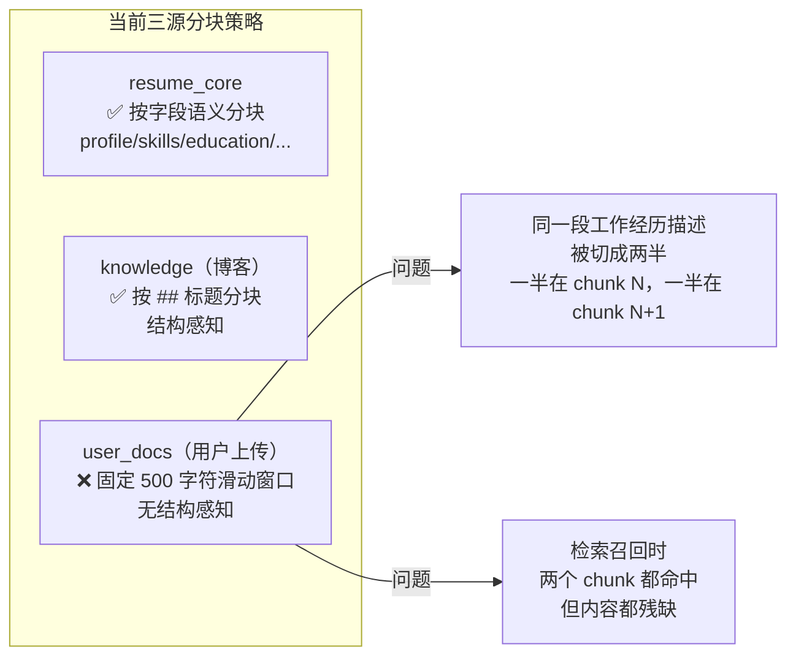
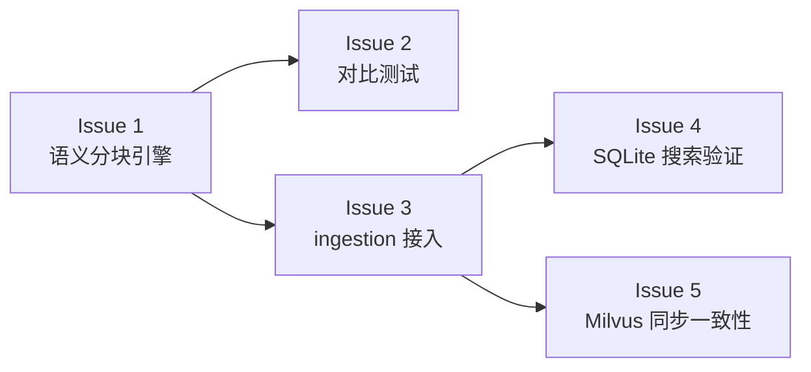

# M24：RAG 检索与召回质量优化（分块策略与同步一致性）

> 状态：**规划文档**  
> 前置条件：M21（RAG 最小闭环）、M22（AI 简历导入）收束后进行。

## 一、为什么需要这个里程碑

### 当前痛点



| 源 | 分块方式 | 质量 |
|---|---|---|
| resume_core | 按字段语义（profile/skills/education/experience/project） | 好 |
| knowledge（博客） | 按 `##` Markdown 标题分段 | 好 |
| **user_docs** | 固定 500 字符滑动窗口 | **差** |

user_docs 是唯一还在用"硬切"策略的源。用户上传的简历/笔记本质上是结构化文档，和 resume_core 一样有天然章节边界，不应该按 500 字符一刀切。

### 另一个问题：Milvus ↔ 本地同步

```
本地开发环境                 ECS 生产环境
───────────                 ───────────
Milvus 运行                 Milvus 不运行
向量 → Milvus gRPC          向量 → SQLite 内存余弦

    ↓                            ↓
 同一份数据，不同存储后端

但分块策略不一致时：
- 本地 Milvus 召回好 → 上线 ECS SQLite 召回差
- 开发时调试的效果和生产不一致
```

---

## 二、目标与非目标

### 目标

1. **user_docs 语义分块**：用 Markdown 结构感知分块替代固定 500 字符滑动窗口
2. **分块策略可配置**：新增 `semantic` profile 作为默认，保留 `balanced`/`contextual` 用于对比实验
3. **三源分块策略统一**：resume_core / user_docs / knowledge 都基于语义结构分块
4. **Milvus ↔ SQLite 数据一致性**：确保同一份文档在两端的 chunk 表达一致

### 非目标

- 不改变 resume_core 的分块方式（已经够好）
- 不改变 knowledge 的分块方式（已经够好）
- 不做向量维度变更（保持 1536）
- 不做检索算法大改动（rerank 管道保留）
- 不引入新的向量数据库

---

## 三、Issue 拆解

### Issue 1：[M24: user_docs Markdown 语义分块引擎](https://github.com/Fridolph/my-resume/issues/216)

**背景**：`user-doc-chunking.ts:129-158` 的 `splitUserDocTextIntoChunks` 用固定滑动窗口，不感知文档结构。

**目标**：
- 新增 `splitUserDocByMarkdownSections()` 函数
- 按 `##` 标题分段（和 `rag-knowledge.service.ts` 同策略）
- 段内若过长（> 2000 字符），再按段落（`\n\n`）二次拆分
- 新增 `semantic` profile：无固定 chunkSize，由内容自然决定
- 保留 `splitUserDocTextIntoChunks` 作为 fallback

**改动范围**：
- `apps/server/src/modules/ai/rag/user-doc-chunking.ts`
- 新增 profile `semantic`，`chunkSize`/`chunkOverlap` 语义变为 max/guidance

**验收**：
- Markdown 文档按 `##` 正确分段
- 段过长时按段落二次拆分
- 纯文本（无 ## 标题）回退到段落拆分
- 现有 balanced/contextual 测试继续通过

---

### Issue 2：[M24: chunking 策略对比测试与回归验证](https://github.com/Fridolph/my-resume/issues/217)

**背景**：需要量化新旧分块策略的差异。

**目标**：
- 用样例 Markdown 做新旧策略对比
- 验证：语义分块的 chunk 平均长度分布更合理（不固定在 500）
- 验证：语义分块的 chunk 之间交叉内容更少（无 overlap）
- 回归：旧 API 参数 `chunkSize`/`chunkOverlap` 在 semantic 模式下仍可传入作为 guidance

**改动范围**：
- `apps/server/src/modules/ai/rag/__tests__/user-doc-chunking.spec.ts`

**验收**：
```
text = "# 个人信息\n张三\n## 工作经历\nA公司...\n\nB公司...\n## 项目\n..."
chunks = semantic(text)
→ ["个人信息\n张三", "工作经历\nA公司...B公司...", "项目\n..."]
redundancyRatio = 0（无 overlap）
```

---

### Issue 3：[M24: user-docs ingestion 接入语义分块](https://github.com/Fridolph/my-resume/issues/218)

**背景**：前端上传 user_docs 时，切块策略走 `resolveUserDocChunkingConfig`。

**目标**：
- 默认 profile 从 `balanced` 切换为 `semantic`
- API 参数 `chunkingProfile` 支持 `semantic`
- ingestion 结果元数据反映真实语义分块参数

**改动范围**：
- `apps/server/src/modules/ai/rag/user-doc-chunking.ts` — 新增 semantic profile + resolve 逻辑
- `apps/server/src/modules/ai/rag/user-docs-ingestion.service.ts` — 切换默认 profile
- `packages/api-client/src/types/ai.types.ts` — `RagUserDocChunkingProfile` 加 `semantic`

**验收**：
- 上传 Markdown 文档，chunk 按 `##` 分段
- chunk metadata 中 `chunkSize` 反映实际最大 chunk 长度
- ingestion 结果中 chunkCount 与文档章节数一致

---

### Issue 4：[M24: 语义分块在本地 SQLite 搜索中的检索验证](https://github.com/Fridolph/my-resume/issues/219)

**背景**：ECS 走 `searchChunksFromDatabase`，需要在语义分块后验证检索质量。

**目标**：
- 确保语义分块的 chunk 在 SQLite 内存余弦搜索中正常工作
- 对比：同一查询在旧分块 vs 新分块下的 top-N 结果差异
- 确保 `embeddingJson` 正确存储语义 chunk 的向量

**改动范围**：
- `apps/server/src/modules/ai/rag/rag.service.ts` — `searchChunksFromDatabase` 无需改动
- 新增搜索质量对比脚本或开发日志

**验收**：
- 语义分块的 chunk 能嵌入成功
- 关键词 "my-resume AI 工作台" 能在对应 chunk 中检索到
- top-3 命中 chunk 内容连贯可读

---

### Issue 5：[M24: Milvus ↔ SQLite 向量存储同步一致性](https://github.com/Fridolph/my-resume/issues/220)

**背景**：当前 user_docs ingestion 写入 SQLite（权威）后，异步写入 Milvus（最佳努力）。如果 Milvus 写入失败，只记录 warning。这导致本地和 ECS 的检索质量可能不一致。

**目标**：
- 在 `getStatus()` 中暴露向量存储同步状态
- 增加 `RAG_VECTOR_STORE_SYNC_MODE` 环境变量（`strict` / `lax`，默认 `lax` 保持当前行为）
- 在 Admin RAG 状态面板中展示同步状态

**改动范围**：
- `apps/server/src/modules/ai/rag/rag.service.ts` — `getStatus()` 增加 vector store sync info
- `apps/server/src/modules/ai/rag/user-docs-ingestion.service.ts` — sync mode 控制
- Admin 前端 RAG knowledge 面板（如已存在）

**验收**：
- `getStatus()` 返回 `vectorStoreSynced` 及最近同步时间/错误
- `lax` 模式下保持当前行为
- `strict` 模式下 Milvus 失败时 ingestion 报错（开发环境使用）

---

## 四、建议实施顺序



Issue 1 是核心依赖，必须先做。Issue 2/3 可并行。Issue 4/5 依赖 Issue 3。

## 五、风险与边界

| 风险 | 缓解 |
|---|---|
| 语义分块后 chunk 数量变化大 | 保留 `maxChunkSize` 参数作为 guidance，超大段二次拆分 |
| 纯文本（无 `##`）无法语义分块 | 回退到段落拆分（`\n\n`），仍比固定窗口好 |
| 旧 balanced/contextual 依赖方 | 保留旧函数，semantic 为新增路径 |
| Milvus sync strict 模式可能影响开发体验 | 默认 lax，strict 通过环境变量按需开启 |

## 六、关联文档

- AI/RAG 学习引导：`docs/10-架构设计/06-my-resume-AI-RAG-学习引导与真实链路说明.md`
- M21 开发日志：`docs/30-开发日志/M21-issue-179-user-docs-入库契约与最小接口闭环.md`
- RAG 管线拆解：`docs/60-源码拆解/08-RAG-检索与问答-管线与重排拆解.md`
