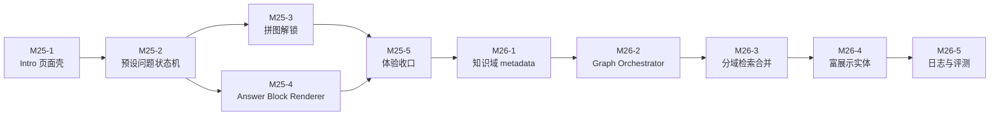

# M25 / M26：AI Intro 与 LangGraph 多域 RAG Issue 草案

> 状态：已创建 GitHub Issues，本文保留为拆分依据与回看清单  
> 前置：M23 公开站 AI Chat Drawer、RAG 问答、会话治理闭环已完成。  
> 关联架构文档：`docs/10-架构设计/08-AI-Intro-与-LangGraph-多域-RAG-架构决策草案.md`

## 总体方向

本轮分成两个里程碑推进：

- M25：先做 AI Intro 独立页面和 AGUI 风格回答展示，重点在前端体验和结构化 block 渲染。
- M26：再做 LangGraph 多域路由 RAG，重点在检索质量、回答编排和知识域治理。

这两个里程碑都不替换现有头像 Chat Drawer。头像入口继续作为 Quick Ask；AI Intro 是独立的引导式体验页面。

## GitHub Issue 清单

| Issue | 标题 | Milestone |
|---|---|---|
| [#221](https://github.com/Fridolph/my-resume/issues/221) | M25: AI Intro 独立页面与双栏交互壳 | M25 |
| [#222](https://github.com/Fridolph/my-resume/issues/222) | M25: 预设问题流程与 10 步引导状态机 | M25 |
| [#223](https://github.com/Fridolph/my-resume/issues/223) | M25: 右侧 10 块拼图解锁面板 MVP | M25 |
| [#224](https://github.com/Fridolph/my-resume/issues/224) | M25: Answer Block Renderer 与 AGUI 风格卡片展示 | M25 |
| [#225](https://github.com/Fridolph/my-resume/issues/225) | M25: AI Intro 体验收口与文档沉淀 | M25 |
| [#226](https://github.com/Fridolph/my-resume/issues/226) | M26: Chat 知识域 metadata 与路由约定 | M26 |
| [#227](https://github.com/Fridolph/my-resume/issues/227) | M26: LangGraph Chat Orchestrator 接入 | M26 |
| [#228](https://github.com/Fridolph/my-resume/issues/228) | M26: 基础简历上下文与分域检索合并策略 | M26 |
| [#229](https://github.com/Fridolph/my-resume/issues/229) | M26: 富展示实体与 Cards 数据模型 | M26 |
| [#230](https://github.com/Fridolph/my-resume/issues/230) | M26: 多域 RAG 可观测日志与评测样例 | M26 |

旧 M24 残留整理：

- [#219](https://github.com/Fridolph/my-resume/issues/219)：已关闭，检索验证并入 #230。
- [#220](https://github.com/Fridolph/my-resume/issues/220)：保留为 deferred backlog，后续单独处理 Milvus / SQLite 同步一致性。

## M25：AI Intro 引导页与 AGUI 风格回答展示

### M25 目标

- 新增独立 AI Intro 页面。
- 用预设问题引导访客了解候选人。
- 通过右侧拼图 / 人物画像区域逐步解锁个人能力地图。
- 将现有 `answerBlocks` 升级为正式的前端结构化回答展示层。

### M25 非目标

- 不做 LangGraph 路由。
- 不做物理分表。
- 不做 2D 数字人。
- 不开放 Intro 页自由输入。
- 不替换现有头像 Chat Drawer。

### Issue 草案 1：M25 / AI Intro 独立页面与双栏交互壳

**背景**

现有 `ai-talk` 已有入口页、chat 页和 resume-advisor 页壳，但还没有一个专门承载“引导式了解我”的独立体验页。当前头像 Chat Drawer 更适合 Quick Ask，不适合承载强视觉的渐进式介绍。

**目标**

- 新增 `/{locale}/ai-talk/intro` 页面。
- 页面采用左侧大聊天窗口、右侧人物画像 / 解锁区域的双栏布局。
- 复用现有公开站 AI Talk 页面框架、locale、published resume 数据读取方式。
- 移动端降级为上下布局。

**改动范围**

- `apps/web/app/[locale]/ai-talk/intro/page.tsx`
- `apps/web/app/[locale]/ai-talk/intro/_intro/`
- `apps/web/app/[locale]/ai-talk/_ai-talk/`
- i18n 文案
- 对应 web tests

**验收标准**

- 访问 `/zh/ai-talk/intro` 能看到独立 AI Intro 页面。
- 页面左侧为引导式聊天区域，右侧为可解锁视觉区域。
- 不影响头像 Chat Drawer 的打开和 Quick Ask 流程。
- 桌面和移动端布局不遮挡、不溢出。

**测试计划**

- web component spec 覆盖页面渲染。
- 手工验证桌面与移动端视口。
- `pnpm --filter @my-resume/web typecheck`

### Issue 草案 2：M25 / 预设问题流程与 10 步引导状态机

**背景**

AI Intro 首版不开放自由输入，而是通过预设问题控制体验节奏，避免问答发散，也更适合右侧解锁效果。

**目标**

- 定义 10 个预设问题。
- 用户只能选择未完成的问题。
- 每个问题完成后进入 completed 状态。
- 页面刷新后可恢复已完成进度。
- 为后续服务端真实回答预留接口适配层。

**改动范围**

- Intro 页面本地状态管理
- 预设问题配置
- localStorage 恢复逻辑
- 对应 web tests

**验收标准**

- 首次进入显示 10 个预设问题。
- 点击问题后，左侧聊天区追加用户问题和 AI 回答。
- 已完成问题不可重复触发，或重复触发时只回看结果。
- 刷新页面后进度不丢失。

**测试计划**

- 覆盖首次进入、点击问题、完成状态、刷新恢复。
- 覆盖移动端问题列表可用性。

### Issue 草案 3：M25 / 右侧 10 块拼图解锁面板 MVP

**背景**

用户希望 AI 回答时页面能有所联动，形成“战争迷雾逐步散开”或“收集套装”的感觉。首版采用 10 块拼图解锁，更容易实现和验证。

**目标**

- 右侧实现 10 个解锁碎片。
- 每个碎片绑定一个预设问题主题。
- 问题完成后点亮对应碎片。
- 解锁后显示关键词、主题名和简短说明。

**改动范围**

- Intro 右侧视觉组件
- 解锁状态类型
- 动效与响应式样式
- 对应 web tests

**验收标准**

- 未解锁碎片有清晰的未完成状态。
- 完成问题后对应碎片点亮。
- 10 个问题完成后右侧展示完整画像 / 技能地图。
- 动效不影响页面滚动和输入。

**测试计划**

- 覆盖单块解锁、多块解锁、全部完成状态。
- 手工验证动效和响应式布局。

### Issue 草案 4：M25 / Answer Block Renderer 与 AGUI 风格卡片展示

**背景**

当前 server 和 api-client 已有 `answerBlocks` 雏形，但前端消息列表对多数 block 未做正式展示。需要把结构化回答升级为可复用渲染层，支撑项目卡片、兴趣卡片、文章卡片等多样化表达。

**目标**

- 新增统一 Answer Block Renderer。
- 支持 `project_card`、`experience_card`、`hobby_card`、`article_card`、`media_card`、`summary`、`system_notice`。
- Quick Ask 和 AI Intro 均可复用。
- citation tooltip 继续保留。

**改动范围**

- `apps/web/app/_shared/ai-chat/`
- `packages/api-client` 类型如需同步则补充
- web tests

**验收标准**

- 项目类回答能展示 ProjectCard。
- 兴趣类回答能展示 HobbyCard。
- 文章或学习笔记类回答能展示 ArticleCard。
- 没有 block 时仍正常展示纯文本。
- citation tooltip 不退化为纯文本。

**测试计划**

- 覆盖每种 block 的渲染。
- 覆盖无 block 的 fallback。
- 覆盖 citation tooltip 与 block 同时存在。

### Issue 草案 5：M25 / AI Intro 体验收口与文档沉淀

**背景**

AI Intro 是新的公开站主体验，需要在交互、视觉、移动端和文档上完成首版收口。

**目标**

- 收口 Intro 页面视觉和交互细节。
- 补充桌面与移动端人工验证记录。
- 更新开发日志与源码拆解入口。
- 明确后续进入 M26 的边界。

**改动范围**

- Intro 页面样式与测试
- `docs/30-开发日志/`
- 可选 `docs/60-源码拆解/`

**验收标准**

- 10 个预设问题完整跑通。
- 右侧解锁效果稳定。
- 移动端可完成同样流程。
- 文档记录实际实现、测试结果和遗留风险。

**测试计划**

- `pnpm --filter @my-resume/web test -- <intro related specs>`
- `pnpm --filter @my-resume/web typecheck`
- `pnpm check:tsx-types`

## M26：LangGraph 多域路由检索与高质量回答

### M26 目标

- 将 Chat 回答从单一路径升级为可观测的图谱编排。
- 通过问题意图识别进入不同知识域检索。
- 将基础简历上下文与分域知识合并，提升回答质量。
- 为结构化 cards 和 AI Intro 解锁提供更稳定的数据来源。

### M26 非目标

- 不直接把 chunk 拆成多张物理表。
- 不引入复杂运营报表。
- 不做自动数据采集。
- 不做 2D 数字人。

### Issue 草案 1：M26 / Chat 知识域 metadata 与路由约定

**背景**

当前 RAG 已有 resume、knowledge、user_docs 等来源，但缺少面向问答意图的知识域划分。需要先定义逻辑域，再让检索可以按域过滤和组合。

**目标**

- 定义知识域：`resume_core`、`projects`、`experience`、`skills`、`hobbies`、`writing_media`。
- 为 chunk metadata 增加或规范 `knowledgeDomain`、`contentType`、`sourceCollection`、`renderHint`。
- 明确默认检索策略：所有问题默认带 `resume_core`，再叠加目标域。

**改动范围**

- RAG types
- user docs ingestion metadata
- resume / knowledge chunk metadata
- server tests

**验收标准**

- 新写入 chunk 带有明确知识域 metadata。
- 旧数据缺少 metadata 时有兼容 fallback。
- 检索接口可以按知识域过滤。

**测试计划**

- 覆盖 metadata 写入。
- 覆盖按域过滤检索。
- 覆盖旧数据 fallback。

### Issue 草案 2：M26 / LangGraph Chat Orchestrator 接入

**背景**

当前 `AiChatService.generateAnswer()` 同时承担分类、检索、回答和 block 构建职责。随着多域 RAG 增强，应该引入单独编排层承载图谱逻辑。

**目标**

- 新增 `AiChatGraphService` 或等价 Orchestrator。
- 初步实现 `input_normalize -> intent_and_domain_route -> boundary_guard -> retrieve -> answer_compose`。
- `AiChatService` 继续负责会话、SSE、消息持久化。
- 保留现有回答路径作为 fallback。

**改动范围**

- `apps/server/src/modules/ai/chat/`
- chat tests
- DI module wiring

**验收标准**

- 普通问题能通过 graph 路由生成回答。
- 越界问题仍被拒答。
- graph 异常时可 fallback 到现有路径或返回可读错误。
- SSE event 顺序不破坏现有前端消费。

**测试计划**

- 覆盖正常路由、越界、fallback。
- 覆盖 SSE start/token/citation/block/done 顺序。
- `pnpm --filter @my-resume/server typecheck`

### Issue 草案 3：M26 / 基础简历上下文与分域检索合并策略

**背景**

只按单一域检索容易回答片面。公开站问答应该始终以“我是谁”的基础简历上下文为底，再叠加项目、兴趣、创作等分域内容。

**目标**

- 所有回答默认检索 `resume_core`。
- 按路由结果追加一个或多个目标域。
- 合并 citations 时保留来源域和 score。
- 低相关结果进入拒答或不确定回答。

**改动范围**

- Graph retrieval nodes
- RAG query options
- citation metadata
- server tests

**验收标准**

- 项目类问题优先命中 `projects + resume_core`。
- 兴趣类问题优先命中 `hobbies + resume_core`。
- 创作类问题优先命中 `writing_media + resume_core`。
- citations 能看出来源域。

**测试计划**

- 准备固定 fixture 覆盖三类问题。
- 断言路由域、citations、answer blocks。

### Issue 草案 4：M26 / 富展示实体与 Cards 数据模型

**背景**

向量 chunk 适合检索，不适合承载所有 UI 展示字段。ProjectCard、HobbyCard、ArticleCard 等需要独立的展示实体或 metadata 补充。

**目标**

- 定义 rich card 数据模型。
- 支持 hobby / article / media / project 等展示字段。
- 将 chunk 检索结果映射到对应展示实体。
- 前端 card renderer 不依赖长文本 snippet 伪造展示数据。

**改动范围**

- server chat block builder
- api-client block types
- web card renderer
- tests

**验收标准**

- hobby 问题能展示含标题、描述、关键词、可选媒体的 HobbyCard。
- article 问题能展示 ArticleCard。
- project 问题能展示 ProjectCard。
- 缺少富展示实体时降级为文本 + citation。

**测试计划**

- 覆盖实体映射成功与 fallback。
- 覆盖 api-client 类型。
- 覆盖 web block renderer。

### Issue 草案 5：M26 / 多域 RAG 可观测日志与评测样例

**背景**

多域路由上线后，需要知道问题被分到了哪个域、命中了什么内容、回答是否用了正确来源，否则质量无法持续优化。

**目标**

- 记录 chat graph 路由日志。
- 记录检索域、top citations、score、fallback 原因。
- 建立最小评测样例集。
- 在开发日志中沉淀召回质量对比。

**改动范围**

- server ai chat logs
- RAG eval fixtures
- `docs/30-开发日志/`
- 可选 `docs/60-源码拆解/`

**验收标准**

- 每次回答可定位 route domain、retrieval result、answer block 类型。
- 至少覆盖项目、兴趣、创作、越界四类评测样例。
- 文档说明 M26 召回质量相对 M23 的变化。

**测试计划**

- server tests 覆盖日志摘要字段。
- 手工运行固定问题集并记录结果。

## 建议实施顺序

## 总体验收标准

- M25 结束后，公开站具备独立 AI Intro 页面，访客可以通过 10 个预设问题完成一次渐进式了解体验。
- M25 结束后，项目 / 兴趣 / 创作等回答可以通过结构化 card 展示，而不是只有文本。
- M26 结束后，Chat 回答具备多域路由检索能力，项目、兴趣、创作类问题能命中对应知识域。
- Quick Ask Drawer 保持可用，不被 Intro 页面替代。
- 所有新增 issue 均有开发日志和对应测试或人工验证记录。
