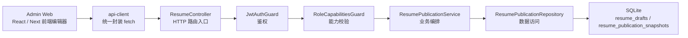
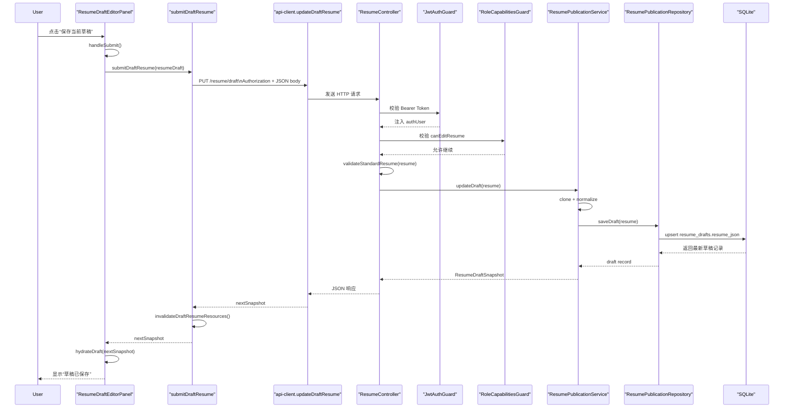

# Admin 简历保存链路：全景与草稿落库

这篇文档先只聚焦 `2` 个点：

1. 整个系统的保存链路全景
2. 一次“保存草稿”请求，如何从 `admin web` 进入后端并落到 `SQLite`

> 目标不是把所有细节一次性讲完，而是先把“主干骨架”建立起来。

---

## 1. 系统全景图：谁在和谁说话

先把整个链路缩成一张图。

你现在可以先只记住一句话：

- 前端负责“把完整简历 JSON 送过来”
- 后端负责“校验、规范化、持久化”
- 数据库当前负责“把整份简历 JSON 存起来”

### 1.1 从架构师视角看，这条链路分成 3 层

虽然图里有很多节点，但真正的骨架只有三层：

- **接口层**：`ResumeController + Guards`
- **业务层**：`ResumePublicationService`
- **持久化层**：`ResumePublicationRepository + SQLite`

这样分是为了让三类问题分开：

- “请求是否合法”放在接口层
- “业务动作应该怎么组织”放在业务层
- “数据到底怎么存”放在持久化层

---

## 2. 一次保存草稿请求，如何真的落到 SQLite

下面我们只看一条最关键的链路：

**管理员在后台点击“保存当前草稿”后，发生了什么。**

### 2.1 真实时序图

这张图里真正最重要的是中间这段：

`Controller -> Service -> Repository -> SQLite`

前后两端都只是“把请求送进去”和“把结果接回来”。

---

### 2.2 第一步：前端把“当前工作副本”提交出去

#### 源码位置

- `apps/admin/modules/resume/draft-editor-panel.tsx`
- `apps/admin/modules/resume/editor/resume-draft-editor-submit.ts`
- `packages/api-client/src/resume.ts`

#### 它在做什么

后台编辑器提交入口在 `handleSubmit()`。

它先做 3 件事：

- 阻止表单默认提交
- 把按钮切到 `pendingSave`
- 清掉上一次的错误和反馈消息

然后调用 `submitDraftResume()`，把当前内存里的 `resumeDraft` 送出去。

`submitDraftResume()` 自己并不直接写 `fetch`，而是继续调用 `api-client` 的 `updateDraftResume()`：

- 拼接 `PUT /resume/draft`
- 带上 `Authorization: Bearer <accessToken>`
- 把整个 `resumeDraft` 做成 `JSON body`

#### 为什么这么做

这里体现了两个架构意图：

1. **编辑器组件不直接关心 HTTP 细节**
   - 它只关心“我要保存当前草稿”
2. **`api-client` 变成统一协议层**
   - 请求方法、路径、header、错误处理都集中收口

你可以把这里理解成：

- `ResumeDraftEditorPanel` 负责“用户交互”
- `api-client` 负责“把交互翻译成 HTTP 请求”

---

### 2.3 第二步：请求先过 Controller，但真正先被 Guards 拦住

#### 源码位置

- `apps/server/src/modules/resume/resume.controller.ts`
- `apps/server/src/modules/auth/guards/jwt-auth.guard.ts`
- `apps/server/src/modules/auth/guards/role-capabilities.guard.ts`

#### 它在做什么

后端路由入口是：

- `@Put('draft')`

而且它不是裸奔的，它前面挂了两道守卫：

- `JwtAuthGuard`
- `RoleCapabilitiesGuard`

流程是这样的：

1. `JwtAuthGuard` 从请求头拿 `Authorization`
2. 检查是否是 `Bearer xxx`
3. 调 `AuthService.verifyAccessToken()` 验证 token
4. 把解析出的用户信息挂到 `request.authUser`
5. `RoleCapabilitiesGuard` 再读 `request.authUser`
6. 根据角色计算 capability
7. 判断当前用户有没有 `canEditResume`

只有这两关都过了，才会真的进入控制器方法本体。

随后 `ResumeController.updateDraftResume()` 还会做一次：

- `validateStandardResume(resume)`

也就是对收到的 JSON 做模型合法性校验。

#### 为什么这么做

这一层的核心思想是：

- **Guard 负责“你能不能进来”**
- **Controller 负责“你带来的请求长得对不对”**

这样可以把“身份权限”和“请求结构”分开。

如果以后同一个 service 还要被别的入口复用，这种分层会非常稳。

---

### 2.4 第三步：Service 不急着存，先做业务层规范化

#### 源码位置

- `apps/server/src/modules/resume/resume-publication.service.ts`

#### 它在做什么

当 controller 校验通过后，会调用：

- `resumePublicationService.updateDraft(resume)`

这个方法内部不是直接把收到的对象原样塞进数据库，而是先做两件事：

1. `cloneStandardResume(resume)`
2. `normalizeStandardResume(...)`

然后再把规范化后的结果交给 repository。

另外它还包了一层：

- `runWithDatabaseLockHint()`

如果底层 SQLite 因为文件锁冲突报错，service 会把底层异常翻译成更友好的业务错误。

#### 为什么这么做

这一层很像“后端装配车间”：

- controller 传进来的只是“一个通过校验的 JSON”
- service 要把它变成“可稳定入库的业务对象”

这里的 `normalize` 很关键，因为它意味着：

- 数据入库前先统一格式
- 后面读出来时更容易保持一致
- 不把“脏格式”直接散落到数据库里

所以 service 关注的不是“HTTP 怎么收”，而是：

- **这个业务对象落库前应该长成什么样**

---

### 2.5 第四步：Repository 才是真正和 SQLite 说话的人

#### 源码位置

- `apps/server/src/modules/resume/resume-publication.repository.ts`
- `apps/server/src/database/schema.ts`
- `apps/server/src/database/resume-records.ts`

#### 它在做什么

`ResumePublicationRepository.saveDraft()` 会先调用：

- `createResumeDraftRecord(resume, updatedAt)`

把领域对象整理成数据库记录，主要字段是：

- `resumeKey`
- `schemaVersion`
- `resumeJson`
- `updatedAt`

然后执行的是一个非常关键的动作：

- `insert ... onConflictDoUpdate`

也就是常说的 **upsert**：

- 如果这份草稿还不存在，就插入
- 如果已经存在，就按主键冲突更新

当前草稿表定义在 `resume_drafts`：

- 主键：`resume_key`
- 内容：`resume_json`

而 `resume_json` 这一列当前直接存的是：

- `StandardResume`

也就是说，这一版架构不是把简历拆成很多关系表，而是：

- 用一条草稿记录
- 把整份标准简历 JSON 存到 `SQLite`

#### 为什么这么做

这是当前阶段一个非常重要的架构取舍：

- 先把“草稿 / 发布闭环”做稳
- 不急着把简历拆成很多张表

好处很直接：

- 结构简单
- 迁移成本低
- 后端和前端围绕同一个 `StandardResume` 契约协作

这非常适合项目当前的“教程型渐进重构阶段”。

---

### 2.6 第五步：响应返回前端，前端再把本地状态重新水合

#### 源码位置

- `apps/admin/modules/resume/editor/resume-draft-editor-submit.ts`
- `apps/admin/modules/resume/draft-editor-panel.tsx`

#### 它在做什么

repository 写入完成后，数据会一路返回：

- repository 返回最新 draft record
- service 包装成 `ResumeDraftSnapshot`
- controller 直接返回 JSON
- `api-client` 解析响应
- `submitDraftResume()` 调 `invalidateDraftResumeResources()`
- `ResumeDraftEditorPanel` 调 `hydrateDraft(nextSnapshot)`

这一步特别值得注意：

前端不是简单地“提示保存成功”就结束了，而是会用服务端返回的最新快照重新同步本地状态。

#### 为什么这么做

因为前端当前已经不只是一个“无脑表单”了，它有：

- 资源缓存
- 本地工作副本
- 拖拽排序状态
- 多语言编辑态

所以保存成功后，最好重新对齐一次“服务端权威快照”，这样状态会更稳。

---

## 3. 你现在先抓住这 3 个结论

### 结论 1：真正的保存主链路，不在某一个文件里

它是一个跨层协作链：

`Admin 编辑器 -> api-client -> controller -> guards -> service -> repository -> SQLite`

所以以后你看这类功能，不要只盯着一个组件或一个接口文件。

### 结论 2：后端不是“收到 JSON 就直接存”

它中间至少还做了：

- 身份校验
- 权限校验
- 模型校验
- 数据规范化
- 锁错误翻译

所以真正稳定的系统，一定不是“controller 直接写数据库”。

### 结论 3：SQLite 当前存的是整份简历 JSON，而不是拆散后的多表模型

这代表当前系统设计优先级是：

- 先保证闭环
- 先保证可讲解
- 先保证演进成本可控

而不是一开始就追求最复杂、最彻底的关系模型。

---

## 4. 下一步最自然的第三点

接下来最适合继续讲的是：

- **为什么这条链必须拆成 `controller -> service -> repository`**

也就是从“这条链怎么跑”进入“为什么要这样设计”。
