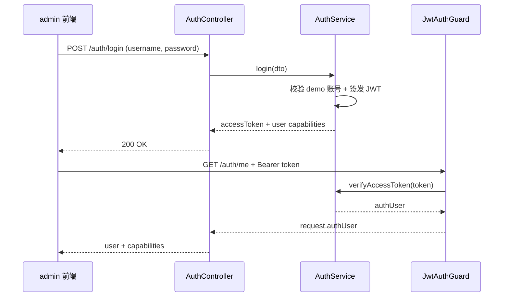
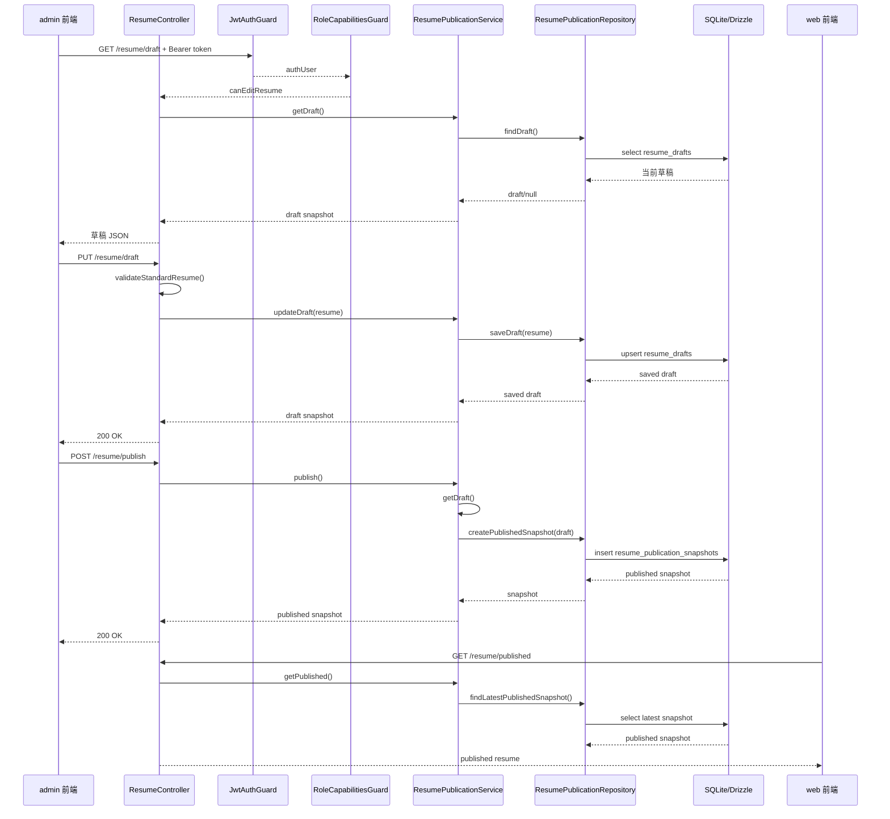
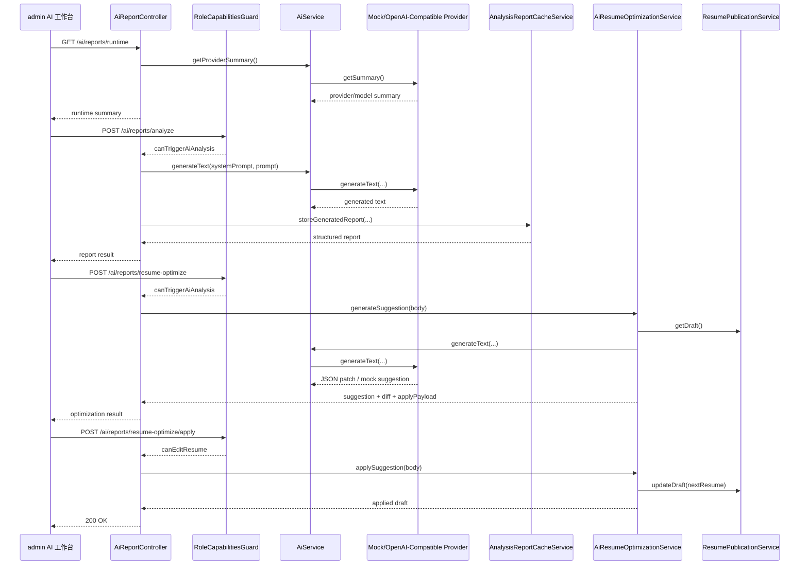
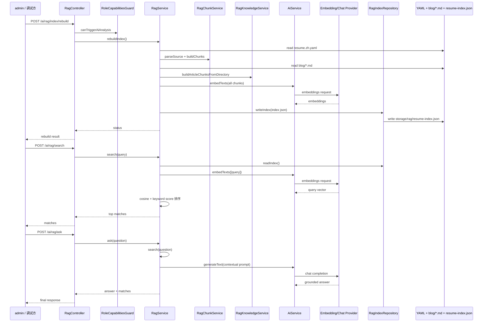

# server 关键链路时序图

本文只聚焦当前 `my-resume` 中最值得先看懂的 4 条链路：

- 登录鉴权
- 简历草稿保存与发布
- AI 分析
- RAG 检索与问答

建议结合以下源码一起看：

- `apps/server/src/main.ts`
- `apps/server/src/app.module.ts`
- `apps/server/src/modules/auth/`
- `apps/server/src/modules/resume/`
- `apps/server/src/modules/ai/`

## 1. 登录与 `/auth/me`

对应源码：

- `apps/server/src/modules/auth/auth.controller.ts`
- `apps/server/src/modules/auth/auth.service.ts`
- `apps/server/src/modules/auth/guards/jwt-auth.guard.ts`

## 2. 草稿读取、保存与发布

对应源码：

- `apps/server/src/modules/resume/resume.controller.ts`
- `apps/server/src/modules/resume/resume-publication.service.ts`
- `apps/server/src/modules/resume/resume-publication.repository.ts`
- `apps/server/src/database/schema.ts`

## 3. AI 分析与简历优化

对应源码：

- `apps/server/src/modules/ai/ai.module.ts`
- `apps/server/src/modules/ai/ai-report.controller.ts`
- `apps/server/src/modules/ai/ai.service.ts`
- `apps/server/src/modules/ai/config/ai-config.ts`
- `apps/server/src/modules/ai/providers/`
- `apps/server/src/modules/ai/ai-resume-optimization.service.ts`

## 4. RAG 建索引、检索与问答

对应源码：

- `apps/server/src/modules/ai/rag/rag.controller.ts`
- `apps/server/src/modules/ai/rag/rag.service.ts`
- `apps/server/src/modules/ai/rag/rag-chunk.service.ts`
- `apps/server/src/modules/ai/rag/rag-knowledge.service.ts`
- `apps/server/src/modules/ai/rag/rag-index.repository.ts`

## 推荐阅读顺序

如果你下次再看 `server`，建议按这个顺序：

1. `apps/server/src/main.ts`
2. `apps/server/src/app.module.ts`
3. `apps/server/src/modules/auth/`
4. `apps/server/src/modules/resume/`
5. `apps/server/src/modules/ai/ai.module.ts`
6. `apps/server/src/modules/ai/ai-report.controller.ts`
7. `apps/server/src/modules/ai/rag/rag.service.ts`

这样更容易先建立“请求怎么进来、权限怎么卡住、数据怎么落库、AI 怎么接进来”的整体感，再去看具体实现细节。
