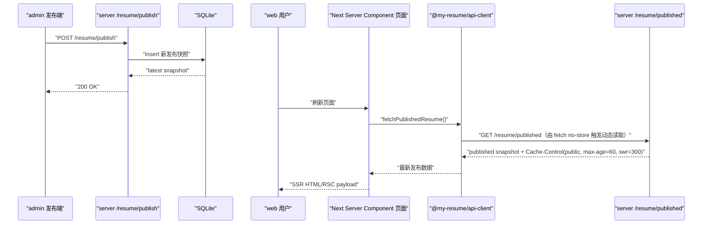

# web 侧 SSR / 缓存策略对照图

本文聚焦你关心的这 3 层：

1. 请求层（`fetch` 怎么发）
2. Next 渲染层（SSR/缓存怎么决策）
3. HTTP 缓存头层（`server` 返回什么缓存语义）

建议边看边对照源码：

- `apps/web/app/page.tsx`
- `apps/web/app/profile/page.tsx`
- `apps/web/app/ai-talk/page.tsx`
- `packages/api-client/src/resume.ts`
- `apps/server/src/modules/resume/resume.controller.ts`

## 1) 三层先建立“职责分工”

- 请求层决定“这次数据读取是否允许框架缓存”
  - 例如：`cache: 'no-store'`
- Next 渲染层决定“页面是静态复用还是每次动态 SSR”
  - 在 App Router 中，`fetch` 缓存策略会影响 route 缓存策略
- HTTP 缓存头层决定“浏览器/CDN 能不能缓存、缓存多久”
  - 例如：`Cache-Control: public, max-age=60, stale-while-revalidate=300`

你可以把它理解成：

- 请求层：给 Next 的“取数指令”
- Next 渲染层：给页面渲染的“执行模式”
- HTTP 头层：给网络缓存节点（浏览器/CDN）的“缓存协商规则”

## 2) 当前项目的三层对照矩阵

| 场景 | 请求层（api-client） | Next 渲染层（App Router） | HTTP 缓存头层（Nest） | 最终效果 |
| --- | --- | --- | --- | --- |
| `web` 首页/个人页/ai-talk 读取发布态 | `fetchPublishedResume(..., { cache: 'no-store' })` | 这次取数不进 Next Data Cache，页面按动态 SSR 读取 | `/resume/published` 返回 `public, max-age=60, stale-while-revalidate=300` | 用户刷新页面时会重新取数据，通常能读到最新发布快照 |
| `web` 读取发布摘要（能力已在 api-client） | `fetchPublishedResumeSummary(..., { cache: 'no-store' })` | 同上，按动态读取 | `/resume/published/summary` 同样是 public 缓存头，且 `Vary` 会考虑 cookie/编码 | 可用于更轻量的公开页读取策略 |
| `admin` 读取草稿（对照项） | 鉴权请求（Bearer Token） | 管理端读取不走公开缓存思路 | `/resume/draft` 返回 `private, no-store, no-cache...` | 草稿读取严格私有，不允许共享缓存 |

## 3) 关键链路时序图（发布后为什么刷新就生效）

## 4) 这套策略在教程阶段为什么合理

- 目标是“先保证学习可见性”，不是先卷复杂缓存优化
- `no-store` 让你更容易观察：
  - 发布后刷新 -> 一定重新请求后端
  - 主链路现象稳定，便于教学和排障
- 后端仍返回 `Cache-Control`，为后续引入 CDN/边缘缓存保留接口契约

## 5) React / Next 最佳实践（结合本项目）

### 5.1 先把缓存策略收敛在“请求层”

- 你们现在把公开读取统一走 `packages/api-client/src/resume.ts`
- 这是很好的实践：缓存策略不分散在各页面，后续改策略只改一处

### 5.2 页面优先保留“薄 Server Component”

- `app/page.tsx` / `app/profile/page.tsx` / `app/ai-talk/page.tsx` 只做取数和拼壳
- 业务展示放到 `modules/*`，可测试性和可维护性更好

### 5.3 私有数据默认 no-store，公开数据按场景分层

- 草稿、鉴权态：继续坚持私有 `no-store`
- 公开只读数据：
  - 若要求“发布后立刻可见” -> 保持 `no-store`
  - 若可接受秒级延迟 -> 可演进到 `revalidate` 或 tag revalidate

### 5.4 渐进演进建议（按教学节奏）

1. **当前阶段（已做）**：`no-store` 保证链路可观察、易讲解  
2. **下一阶段**：公开页切到 `summary` 接口，先减载再谈复杂缓存  
3. **再下一阶段**：引入 `revalidateTag/revalidatePath`，在发布动作后主动失效页面缓存

## 6) 读代码时可以先抓的 4 个点

1. `apps/web/app/page.tsx`：页面入口如何触发 SSR 取数
2. `packages/api-client/src/resume.ts`：`fetchPublishedResume` 的 `cache: 'no-store'`
3. `apps/server/src/modules/resume/resume.controller.ts`：`applyPublicCacheHeaders` / `applyPrivateNoStoreHeaders`
4. `apps/server/src/modules/resume/resume-publication.service.ts`：发布快照的读取与写入语义

当你能把这 4 个点串起来，你就已经掌握了这套 web 侧 SSR/缓存策略的主干逻辑
