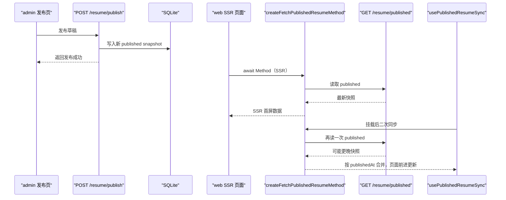

# alova Method-first：SSR / CSR 实践与避坑

这篇文档专门回答 4 个问题：

1. 为什么我们把 `api-client` 改成只导出 `createXxxMethod`
2. alova hooks 应该怎么拆，和项目怎么配合
3. SSR / CSR 分别怎么请求才稳定
4. 水合、数据变化、重复请求这些常见坑怎么处理

建议配合源码阅读：

- `packages/api-client/src/client.ts`
- `packages/api-client/src/auth.ts`
- `packages/api-client/src/resume.ts`
- `packages/api-client/src/ai.ts`
- `apps/web/app/[locale]/page.tsx`
- `apps/web/app/_shared/published-resume/hooks/use-published-resume-sync.ts`
- `apps/admin/app/[locale]/_auth/login-shell.tsx`
- `apps/admin/app/[locale]/dashboard/_shared/dashboard-shell.tsx`

---

## 1. 为什么统一成 Method-first

### 1.1 Promise facade 的问题

旧模式里 `fetchPublishedResume` 这类 Promise facade，本质是把 `method.send()` 再包一层函数。问题是：

- 表面简化，实际隐藏了 alova 的原生能力
- 组件侧想用 hooks 时还要绕回 method，不够直接
- SSR / CSR 两套写法容易分裂
- API 数量会翻倍（`fetchXxx + createXxxMethod`），维护成本高

### 1.2 Method-first 的收益

统一保留 `createXxxMethod` 后，语义变成：

- 先构造请求方法（Method）
- 再按场景决定“怎么发送”

同一个 Method 可以被三种场景复用：

- SSR：`await createXxxMethod(...)`
- CSR hooks：`useRequest(() => createXxxMethod(...))`
- 手动触发：`await createXxxMethod(...).send()`

这就是“同一份请求定义，多种消费方式”。

---

## 2. 我们现在怎么拆 alova（职责边界）

### 2.1 `packages/api-client` 只做“请求契约层”

`api-client` 不做页面状态管理，只负责两类事情：

1. **领域 Method 工厂**
   - `auth.ts` / `resume.ts` / `ai.ts`
   - 每个函数只做“请求语义定义”（路径、方法、body、fallback 文案等）
2. **全局请求内核**
   - 在 `client.ts` 里集中做：
     - `beforeRequest` 注入 Bearer token
     - `responded.onSuccess` 统一解析 `json/text/raw`
     - `404 -> null`（由 `returnNullOnNotFound` 控制）
     - 错误消息提取与回退

这样页面层不会散落重复逻辑。

### 2.2 hooks 放在 `apps/*`，不放在 `packages/api-client`

我们把 hooks 视为“UI 策略”，所以在应用层使用：

- `apps/web`、`apps/admin` 组件里使用 `useRequest`
- `api-client` 保持 framework-agnostic（不绑定页面状态）

这让 `api-client` 更像稳定 SDK，而不是页面工具箱。

---

## 3. SSR / CSR 在项目中的标准写法

### 3.1 SSR（Next Server Component）

在 Server Component 直接 `await Method`：

```ts
const publishedResume = await createFetchPublishedResumeMethod({ apiBaseUrl })
```

项目落点：

- `apps/web/app/[locale]/page.tsx`
- `apps/web/app/[locale]/profile/page.tsx`
- `apps/web/app/[locale]/ai-talk/page.tsx`

这是 alova 官方推荐模式之一：Method 是 PromiseLike，天然可 `await`。

### 3.2 CSR（交互场景）

在 Client Component 用 `useRequest`：

- 手动触发：`immediate: false` + `send()`
- 首次加载：可在 `useEffect` 中按条件触发
- 避免重复请求：通过 `requestKeyRef` 控制同 key 只触发一次

项目落点（典型）：

- 登录：`apps/admin/app/[locale]/_auth/login-shell.tsx`
- 仪表盘：`apps/admin/app/[locale]/dashboard/_shared/dashboard-shell.tsx`
- AI 工作台：`apps/admin/app/[locale]/dashboard/ai/_ai/ai-workbench-shell.tsx`

---

## 4. 水合与“数据变了怎么办”

这是 SSR 项目最常见坑：  
服务端渲染时拿到一份数据，客户端挂载后数据可能已经变化。

我们在 `web` 公开页采用“SSR 首屏 + 客户端二次校准”：

1. SSR 先渲染 `publishedResume`（保证首屏稳定）
2. 客户端挂载后再触发一次同步请求
3. 只允许数据前进，不允许回退

核心实现：`usePublishedResumeSync`

- 文件：`apps/web/app/_shared/published-resume/hooks/use-published-resume-sync.ts`
- 关键策略：
  - `initialData` 先吃 SSR 数据，避免水合闪空
  - `requestIdleCallback` 空闲时同步，减轻首屏竞争
  - `syncRequestKeyRef` 防止相同条件重复同步
  - `pickLatestPublishedSnapshot` 按 `publishedAt` 合并，防回退

### 4.1 为什么不会“闪回旧数据”

`pickLatestPublishedSnapshot` 会比较 `publishedAt`：

- 新数据更晚才替换
- 时间解析失败时优先新值（保守前进）

这能避免接口抖动或时序问题导致的 UI 回滚。

### 4.2 为什么不会“首屏先空白再出现”

只有在“SSR 没数据 + 正在同步”时才显示 Skeleton；  
若 SSR 已有数据，页面直接显示已有内容，只在后台做同步。

对应组件：

- `apps/web/app/_shared/published-resume/published-resume-loading-state.tsx`
- `apps/web/app/[locale]/_resume/shell.tsx`
- `apps/web/app/[locale]/profile/_profile/overview-shell.tsx`
- `apps/web/app/[locale]/ai-talk/_ai-talk/placeholder-shell.tsx`

---

## 5. 发布后为什么 web 很快就能看到新数据



这条链路不是“实时推送”，而是“SSR + 客户端校准”的稳定策略。

---

## 6. alova 在本项目解决了什么，没解决什么

### 6.1 已解决

- 统一 Method 抽象：SSR / CSR / 手动触发一套请求定义
- hooks 状态管理：`loading/error/data/send` 统一
- 全局拦截：token 注入、响应解析、错误归一
- 类型推导：Method 返回类型直接传递到调用方

### 6.2 仍需应用层处理

- 水合一致性：需要业务层决定“SSR 初值 + 客户端校准”策略
- UI 反馈策略：Skeleton、错误提示、重试入口需组件层定义
- 缓存头语义：浏览器/CDN 缓存仍由 `server` 的 HTTP Header 决定

---

## 7. 当前请求优化手段（已落地）

1. **重复请求抑制**
   - `requestKeyRef` 防止相同条件重复触发（尤其 `useEffect` 场景）
2. **写操作防重复提交**
   - `pending` 时禁用按钮（登录、保存草稿、应用 AI 建议等）
3. **加载态统一**
   - 管理端与公开站统一用 HeroUI `Skeleton`
4. **错误信息可读**
   - 服务端 JSON `message/error` 自动提取，fallback 文案兜底

---

## 8. 下一步可演进（不在本轮强推）

1. 在“搜索/筛选”类场景引入 `useWatcher`
2. 在跨组件联动场景评估 `useFetcher` / action delegation
3. 对明确幂等的 GET 场景逐步引入可控缓存策略
4. 在不破坏教程节奏前提下，分 issue 引入重试与超时策略

---

## 9. 一句话复述（团队约定）

`api-client` 只产出 Method，页面按场景消费 Method：  
SSR 直接 `await`，CSR 用 hooks，数据同步靠“SSR 首屏 + 客户端校准 + 只前进合并”。
