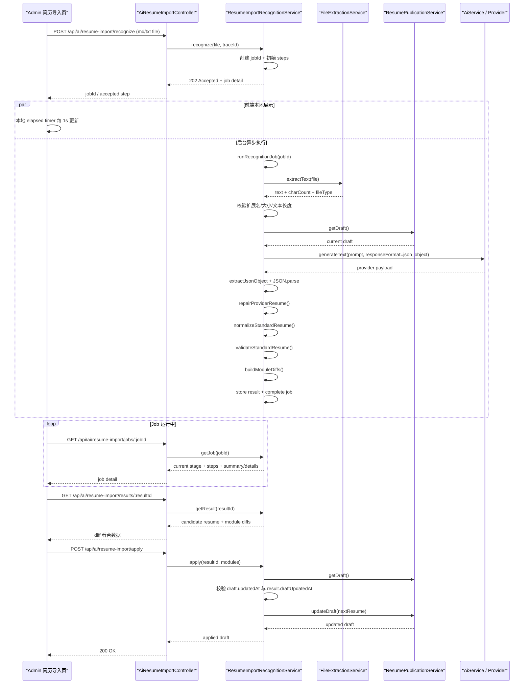
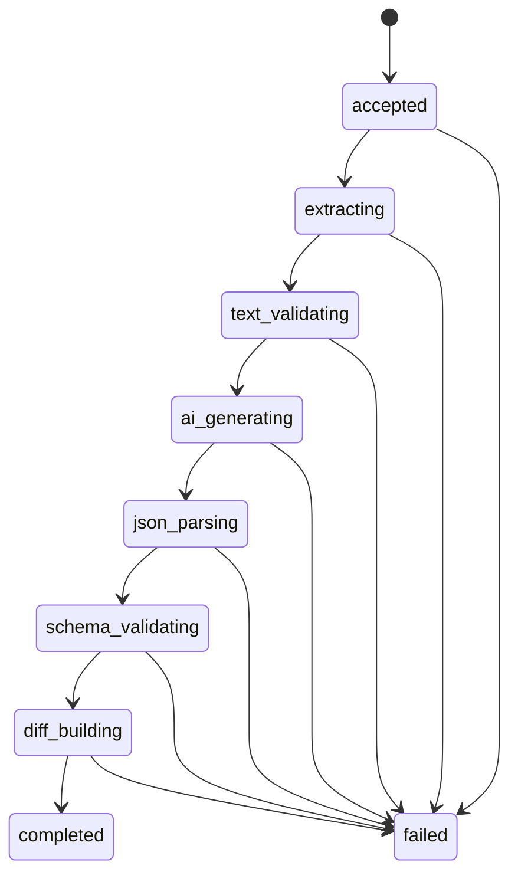

# M22 AI 简历导入识别：时序图、状态流转与优化路线

这篇文档只聚焦一条链路：

`上传简历 -> 异步识别 Job -> 候选草稿 -> Diff 看台 -> 按模块回填`

它适合放在 `M22 / Issue 211` 之后阅读，因为这时功能已经不只是一个“AI 调用接口”，而是一条真正带有状态、容错和可观测性的工程链路。

## 一、先抓住这条链路的 5 个角色

在当前实现里，主要有 5 个参与者：

1. Admin 前端上传面板
2. `AiResumeImportController`
3. `ResumeImportRecognitionService`
4. `AiService + Provider`
5. `ResumePublicationService`

如果只记一句话，可以记成：

> 前端负责发起和观察，`ResumeImportRecognitionService` 负责编排，AI 只负责给候选结果，真正入草稿仍由业务服务控制。

## 二、整体时序图

这个图里最关键的点有 3 个：

1. `recognize` 现在只负责“受理”，不负责同步等 AI 完成。
2. AI 返回后不会直接入业务草稿，必须经过 `repair -> normalize -> validate -> diff`。
3. 真正写回草稿时，还要再过一次“草稿版本是否已变化”的校验。

## 三、Job 状态流转图

这一轮最值得掌握的，是任务已经被显式建模成一个状态机。

和传统“一个 loading 状态”相比，这种建模多了两层价值：

1. 对用户更透明  
   用户知道现在卡在“提取文本”还是“结构校验”。

2. 对开发更可诊断  
   我们能区分：
   - 文件边界问题
   - Provider 问题
   - JSON 解析问题
   - schema 问题
   - diff 构建问题

## 四、为什么前端轮询和本地计时要解耦

这个点很容易被忽略，但它是这轮前端优化里最“工程化”的部分。

当前前端其实同时做了两件不同的事：

1. 本地每秒刷新“已耗时”
2. 按节奏请求后端拿最新 Job 状态

如果把这两个动作混在一个 `useEffect` 里，就很容易出现这个问题：

- 本地计时触发 `setState`
- 组件重新渲染
- 轮询 timeout 被重新创建
- polling 节奏抖动甚至重置

所以现在的实现把它们拆开：

- `displayElapsedMs` 只为 UI 服务
- polling loop 只为网络请求服务
- `fetchJobRef / handleJobUpdateRef` 保持闭包稳定

可以把这件事理解为：

> UI 节拍器和网络节拍器不是一回事，不能因为界面每秒跳动一次，就让请求调度也被拖着重建。

## 五、为什么 AI 输出前面要加 repair 层

这是 AI 功能和普通 CRUD 最大的不同。

普通接口里，我们通常假设服务端自己生产出的对象格式是稳定的。  
但 AI 输出并不是稳定对象，它更像“概率性候选数据”。

当前 repair 主要做了这些事：

- `string -> LocalizedText`
- `{ zh } / { en } -> 补齐 zh/en`
- 非数组模块 -> `[]`
- 数组中非对象项 -> 忽略并记录 warning

这层 repair 的价值不是“纵容 AI 输出乱来”，而是：

1. 先把常见的轻微形状偏差修到可校验
2. 再让 `normalizeStandardResume` 和 `validateStandardResume` 继续做最后把关

所以这条链路应该被理解成：

`AI 输出` -> `repair` -> `normalize` -> `validate` -> `candidate resume`

而不是：

`AI 输出` -> `直接入草稿`

## 六、为什么当前 `details: string[]` 能工作，但不是终点

这轮 Job 时间线已经能展示：

- 阶段摘要 `summary`
- 阶段细节 `details`
- 失败信息 `message`
- 关联排查 ID `traceId`

这已经足够解决 MVP 的两个核心问题：

1. 用户不再只看到“识别失败”
2. 开发者能知道“失败在哪里”

但它仍然偏“文本展示型”，不是“结构化诊断型”。

也就是说，当前方案更像：

- 适合阅读
- 适合调试
- 适合先跑通

还不够适合：

- 按错误类别聚合
- 前端按 `warning / repair / provider / validation` 分层展示
- 做国际化和埋点统计

所以后续很自然的一步，就是从 `details: string[]` 升级到 `diagnostics[]`。

## 七、四个可继续演进的方向

这一块是后面开 Issue 最适合参考的路线图。

### 1. 结构化 diagnostics

目标：

- 保留当前“人能看懂”的细节
- 再补“机器也能理解”的错误码和级别

建议：

- 新增 `diagnostics[]`
- 每项带 `code / level / message / hint / meta`
- 前端优先渲染 `diagnostics`，无则回退 `details`

### 2. SSE 替代轮询

目标：

- 降低无效请求
- 让任务阶段切换更实时

建议：

- 先抽公共 Job 订阅层
- 再新增 `jobs/:jobId/events`
- 前端优先 SSE，失败时回退 polling

### 3. 细粒度 diff

目标：

- 不止知道“哪个模块变了”
- 还知道“模块里哪些字段变了”

建议：

- 先在 `profile`、`projects` 试点
- 先显式字段映射，不急着上全 schema 通用递归 diff

### 4. Job / Result 持久化

目标：

- 避免单进程重启丢失
- 为多实例和后续 SSE 做准备

建议：

- 短期：Redis 托管 Job / Result
- 中期：Redis 运行态 + DB 历史记录双层

## 八、建议的落地顺序

如果后面准备把这条链路继续做深，我建议顺序是：

1. `details -> diagnostics`
2. 抽统一 Job subscription 层
3. SSE + polling fallback
4. `profile/projects` 试点字段级 diff
5. Redis 托管 Job / Result
6. 视需要增加 DB 历史表

这样做的好处是：

- 前 3 步优先提升用户体验和可运维性
- 第 4 步提升用户确认能力
- 第 5/6 步再去补基础设施复杂度

这很符合当前项目“教程型渐进重构”的节奏。

## 九、这一条链路最值得记住的工程原则

最后只记 4 句话就够了：

1. AI 结果不是业务真相，只是候选输入。
2. Job 可观测性本身就是功能的一部分。
3. 前端计时和轮询是两套节拍，不要绑在一起。
4. MVP 可以先简单，但边界、状态和失败路径不能省。
