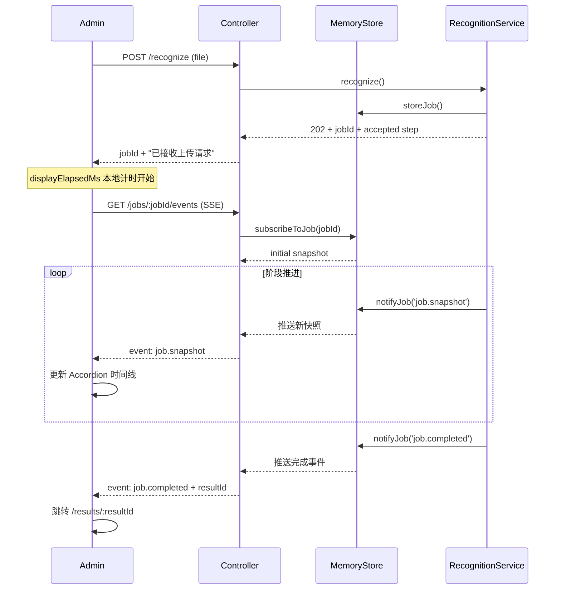
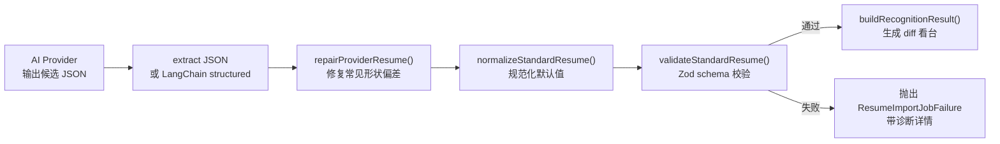

# M22 简历导入识别：12轮源码演进

本文档结合源码逐轮解析 M22 AI 简历导入识别功能的演进过程。建议先读完 `06-M22-AI-简历导入识别-时序图与优化路线.md` 建立整体认知，再按本文档走读关键代码。

## 核心链路一句话

> 上传简历 → 异步 Job 状态机 → AI 生成候选草稿 → repair/normalize/validate 防线 → 模块级 diff → 用户确认 → 按模块回填 draft

---

## 全景架构

```mermaid
flowchart TB
    subgraph Admin["Admin 前端"]
        Shell["resume-import-shell.tsx<br/>页面壳 (229行)"]
        Panel["resume-import-panel.tsx<br/>上传 + SSE + Job 恢复 (662行)"]
        Result["resume-import-result-shell.tsx<br/>diff 看台 + apply"]
        HistoryTable["resume-import-history-table.tsx<br/>历史记录分页"]
    end

    subgraph Controller["AiResumeImportController (324行)"]
        POST_recognize["POST /recognize → 202 + jobId"]
        GET_events["GET /jobs/:jobId/events → SSE"]
        GET_result["GET /results/:resultId → 候选草稿"]
        POST_apply["POST /apply → 按模块写回"]
    end

    subgraph Svc["ResumeImportRecognitionService (681行)"]
        recognize["recognize() 受理并启动异步"]
        createResult["createRecognitionResult() 8阶段管线"]
        apply["apply() 草稿冲突校验 + 合并"]
    end

    subgraph Utils["resume-import/utils/ 纯函数"]
        Job["resume-import-job.ts 状态机"]
        Format["resume-import-format.ts 规则清洗 + 安全过滤"]
        Provider["resume-import-provider-recognition.ts LangChain 结构化流"]
        Repair["resume-import-repair.ts AI 输出修复 (294行)"]
        Diff["resume-import-diff.ts 模块级 diff"]
        Store["resume-import-memory-store.ts 内存 Map + TTL + SSE 订阅"]
    end

    Panel -->|"multipart/form-data"| POST_recognize
    Panel -->|"SSE 订阅"| GET_events
    Result -->|"读取"| GET_result
    Result -->|"确认"| POST_apply
    POST_recognize --> recognize
    recognize --> createResult
    createResult --> Format --> Provider --> Repair --> Diff
```



---

## 关键演进：从同步到异步 Job 状态机

### 第 1 轮的问题

`recognize()` 最初是同步的——直接调用 AI 并等待 3-5 分钟。HTTP 请求会超时。

### 第 2 轮的解决方案

`resume-import-recognition.service.ts:103-123`：

```typescript
recognize(input): ResumeImportJobDetail {
  const jobId = randomUUID()
  const detail = createInitialResumeImportJobDetail(jobId)
  this.memoryStore.storeJob({ createdAt: detail.createdAt, detail })
  // ↑ 先落内存，立即返回 Job 快照

  void this.runRecognitionJob(jobId, input)  // ← 异步执行，不阻塞 HTTP 响应
  return cloneResumeImportJobDetail(job)
}
```

`resume-import.constants.ts:38-82` 定义 10 个固定阶段：

```
accepted → extracting → text_validating → raw_archiving
→ format_normalizing → safety_filtering → ai_generating
→ json_parsing → schema_validating → diff_building
→ completed / failed
```

`resume-import-job.ts:87-122` 的 `moveResumeImportJobToStage()` 推进阶段：

```typescript
// 所有在目标阶段之前的 → completed
// 目标阶段 → running
// 目标阶段之后的 → pending
```

每个阶段都携带 `summary`（摘要）、`details`（诊断详情）、`message`（失败文案）。

### 前端如何观察

`resume-import-panel.tsx` 主路径走 SSE（`GET /jobs/:jobId/events`），`GET /jobs/:jobId` 降级为手动刷新兜底。

前端本地计时和网络轮询**完全解耦**：
- `displayElapsedMs` — 纯 UI，`setInterval` 每秒自增，不触发网络请求
- SSE 回调 — 只更新 Job 数据，不碰计时器



---

## AI 输出不可信：repair → normalize → validate 防线

### 为什么需要这道防线

AI 输出的 JSON 可能：
- 字段是字符串而非 `{ zh, en }` 结构
- 数组字段是 `null` 或字符串
- 数组中有非对象元素
- 缺失必填字段

直接入草稿会导致 `validateStandardResume` 失败，甚至破坏草稿数据。

### repairProviderResume 的逐字段修复

`resume-import-repair.ts:140-294`（294行），按 StandardResume 的 6 大模块逐字段递归修复：

```typescript
// string → LocalizedText
function repairLocalizedText(value, path, repairs) {
  if (isLocalizedText(value)) return value
  if (typeof value === 'string') {
    repairs.push(`已自动修复 ${path}：string -> { zh, en }`)
    return localizedZh(value)
  }
  // ... 缺失字段补齐
}

// 非数组 → []
function repairLocalizedTextArray(value, path, repairs) {
  if (!Array.isArray(value)) {
    repairs.push(`已将 ${path} 非数组内容按空数组处理`)
    return []
  }
  // ... 逐项修复
}
```

每个字段路径都记录到 `repairMessages[]`，最终透出到结果看台的"质量提醒"。

### 完整数据流



`resume-import-recognition.service.ts:414-466` 完整串联了这一管线：

```typescript
const repairResult = repairProviderResume(payload.resume)
const candidateResume = normalizeStandardResume(coreStrengthsPatch.resume)
const validationResult = validateStandardResume(candidateResume)

if (!validationResult.valid) {
  // 把 errors 写入 Job step 的 details，用户和开发者都能看到
  throw new ResumeImportJobFailure(
    `AI 识别结果修复后仍未通过结构校验：${firstError}`,
    [...readableErrors, ...validationResult.errors],
  )
}
```

---

## SSE 实时推送

### 为什么不用 EventSource

`EventSource` 不支持自定义 HTTP Header，无法携带 `Authorization: Bearer xxx`。所以用 `fetch + ReadableStream`：

### 服务端 SSE 端点

`ai-resume-import.controller.ts:172-274` 的 `streamJobEvents()`：

```typescript
// 1. 设置 SSE 头
response.setHeader('Content-Type', 'text/event-stream; charset=utf-8')
response.setHeader('Cache-Control', 'no-cache, no-transform')

// 2. 先推当前快照
writeEvent(initialEvent, initialJob)

// 3. 订阅内存事件
unsubscribe = this.resumeImportRecognitionService.subscribeToJob(
  jobId,
  (event, job) => {
    writeEvent(event, job)
    if (event === 'job.completed' || event === 'job.failed') {
      response.end()
    }
  },
)

// 4. heartbeat 每 15s 一次，让前端知道连接正常
heartbeatTimer = setInterval(() => {
  writeEvent('job.heartbeat', { jobId, timestamp: new Date().toISOString() })
}, 15_000)

// 5. 感知进度提示，每 8-13s 随机推送
scheduleProgressHint()  // 递归 setTimeout
```

### 内存订阅与通知

`resume-import-memory-store.ts:76-103`：

```typescript
subscribeToJob(jobId, subscriber) {
  const subscribers = this.jobSubscribers.get(jobId) ?? new Set()
  subscribers.add(subscriber)
  return () => { subscribers.delete(subscriber) }  // 取消订阅
}

notifyJob(jobId, event) {
  for (const subscriber of this.jobSubscribers.get(jobId) ?? []) {
    subscriber(event)
  }
}
```

服务端每个阶段变化时（`startJobStage`、`updateJobStep`、`completeJob`、`failJob`）都会调用 `notifyJob`，前端立即收到更新。

---

## 输入治理：规则清洗 + 安全过滤

### 职责分层

```
规则层（本地，零 AI 成本）         AI 层（单次调用，长耗时）
─────────────────────────         ────────────────────────────
- 丢弃注入/广告/脚本行             - 理解非标准格式简历
- 标记 riskType                    - 生成 StandardResume 候选草稿
- 生成审计快照 (sha256)            - 补充治理观察
- 产出 formatReport                - 产出候选草稿 + warnings
```

### 规则层核心代码

`resume-import-format.ts:91-127` 的 `filterResumeImportTextByRules()`：

```typescript
const PROMPT_INJECTION_PATTERNS = [
  /ignore\s+(all\s+)?(previous|above)\s+instructions?/i,
  /忽略(以上|之前|所有).{0,12}(指令|规则|提示)/,
  /泄露.{0,12}(system|系统).{0,12}(prompt|提示)/i,
]
const AD_PATTERNS = [/加微(信)?/i, /vx[:：]/i, /推广|广告|博彩|贷款/]
const HTML_OR_SCRIPT_PATTERNS = [/<script[\s>]/i, /<iframe[\s>]/i, /javascript:/i]

// 逐行扫描
for (const rawLine of text.split(/\r?\n/)) {
  const reason = classifyDiscardReason(line)
  if (reason) {
    discardedItems.push({ reason, riskType, summary })
    continue  // ← 丢弃
  }
  keptLines.push(line)
}
```

### 本地与 AI 报告合并

`mergeResumeImportFormatReports()`（135-176行）：

```
本地规则层真正影响了入模文本 → 永远保留，AI 不能覆盖
AI 报告只能作为补充诊断 → append，不覆盖本地审计结果
```

---

## 12 轮演进速览

| 轮次 | 核心问题 | 解决方案 | 关键文件 |
|---|---|---|---|
| 1→2 | 同步等待超时 | 202 + async Job 状态机 | `resume-import-job.ts` |
| 3 | 轮询浪费请求 | SSE 实时推送 | `ai-resume-import.controller.ts:172-274` |
| 5 | AI 输出形状不可靠 | repair → normalize → validate 防线 | `resume-import-repair.ts` (294行) |
| 5 | 结果重启丢失 | `ai_usage_records` 快照持久化 | `resume-import-usage-records.ts` |
| 6 | 历史列表请求风暴 | `requestKeyRef` 幂等保护 | `resume-import-shell.tsx:75-84` |
| 7 | JSON 漏逗号 / 核心字段漏识别 | 本地 JSON 修复 + 确定性兜底 | `resume-import-json.ts` / `resume-import-core-strengths.ts` |
| 8 | 用户输入含注入/广告 | 规则层安全过滤 | `resume-import-format.ts` (317行) |
| 9 | 两次 AI 调用 8 分钟 | 收口为单次调用 | 删除 format AI 调用，合并到 recognition prompt |
| 10→11 | JSON 不稳定 / NaN 显示 | LangChain structured stream + finite 兜底 | `resume-import-provider-recognition.ts` |
| 12 | 刷新丢失进度 | localStorage jobId + 幂等重连 | `resume-import-panel.tsx:157-314` |

---

## 四条工程原则

从这 12 轮中提炼出的原则，比具体代码更重要：

1. **AI 结果 ≠ 业务真相** — 永远是候选输入，必须走 `repair → normalize → validate`
2. **Job 可观测性即功能** — 阶段时间线、诊断 details、traceId 不是锦上添花，是用户和开发者都需要的基础能力
3. **前端计时 ≠ 网络轮询** — 两套节拍必须解耦，不能因为 UI 每秒跳动就重建请求调度
4. **MVP 可以先简单，但状态/边界/失败路径不能省** — 内存 Map 够用，但 202/accepted、failed/traceId、expired/TTL 这些路径从一开始就要画全

---

## 建议阅读顺序

1. 先读 `docs/60-源码拆解/06-M22-AI-简历导入识别-时序图与优化路线.md` — 建立整体认知
2. 再读 `resume-import.constants.ts` — 了解 10 个 Job 阶段定义
3. 读 `resume-import-recognition.service.ts` 的 `createRecognitionResult()` — 理解 8 阶段管线
4. 读 `resume-import-repair.ts` — 理解 AI 输出修复的逐字段策略
5. 读 `resume-import-panel.tsx` — 理解前端 SSE + localStorage 恢复
6. 回到本文档，对照 12 轮表理解"为什么当前代码长这样"

## 关联文档

- 开发日志：`docs/30-开发日志/M22-issue-211-AI-简历导入识别与草稿回填.md`
- 时序图：`docs/60-源码拆解/06-M22-AI-简历导入识别-时序图与优化路线.md`
- 总方案：`docs/10-架构设计/01-个人简历-monorepo-重构总方案-v1学习版.md`
