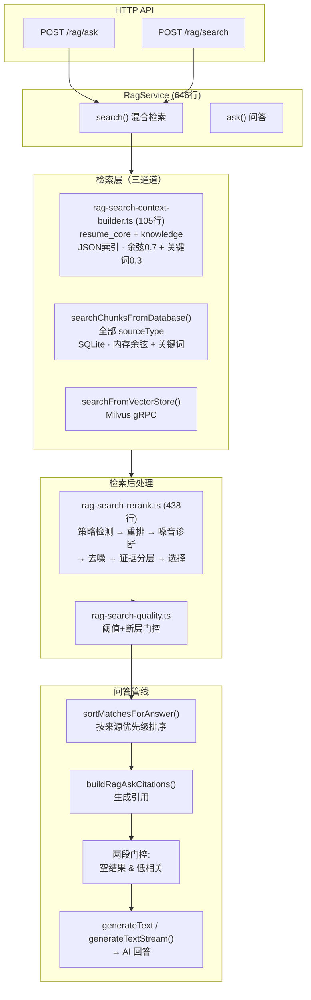
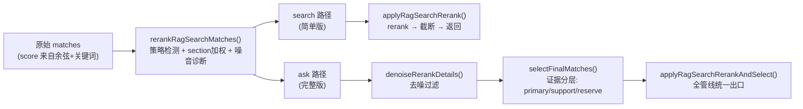
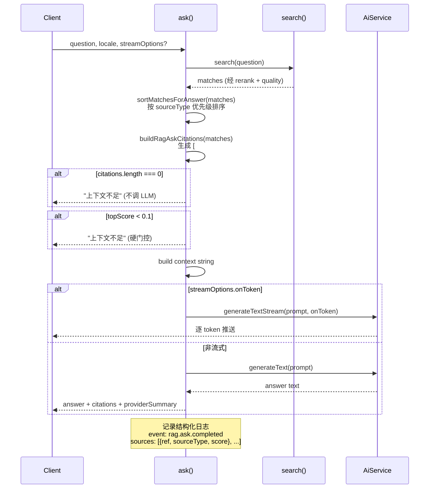

# RAG 检索与问答 — 管线与重排拆解

本文档拆解 `apps/server/src/modules/ai/rag/` 下的 RAG 检索与问答完整管线，适合在读完 `02-server-关键链路时序图.md` 的"RAG 建索引与问答时序"后继续深入。

## 核心链路一句话

> 用户提问 → embedTexts 向量化 → 三通道检索 (Milvus / JSON / SQLite) → 5层重排管道 → 两段门控 → LLM 生成回答 + 引用

---

## 目录结构

```
apps/server/src/modules/ai/rag/
├── rag.module.ts              ← 模块注册
├── rag.service.ts             ← 核心编排 (646行)
├── rag.controller.ts          ← HTTP API 入口
├── rag-chunk.service.ts       ← chunk 构建
├── rag-knowledge.service.ts   ← 知识库构建
├── rag-index.repository.ts    ← JSON 索引读写
├── rag-retrieval.repository.ts ← SQLite 检索 (304行)
├── rag-search-context-builder.ts ← 本地检索 + 余弦相似度 (105行)
├── rag-search-rerank.ts       ← 重排管线 (438行)
├── rag-search-routing.ts      ← 检索路由配置
├── rag-search-quality.ts      ← 质量门控
├── config/
│   └── rag-search-rerank.config.ts ← 重排配置 (178行)
├── vector-store/
│   ├── types.ts               ← 向量存储抽象
│   ├── config.ts              ← 环境变量解析
│   ├── factory.ts             ← 适配器工厂
│   ├── tokens.ts              ← DI tokens
│   ├── milvus-sdk.client.ts   ← Milvus SDK
│   └── adapters/
│       ├── local.adapter.ts
│       └── milvus.adapter.ts
└── __tests__/                 ← 测试目录
```

## HTTP API

| 端点 | 方法 | 用途 |
|---|---|---|
| `/api/rag/ask` | POST | RAG 问答（支持流式） |
| `/api/rag/search` | POST | RAG 检索（纯结果） |
| `/api/rag/index/rebuild` | POST | 重建索引 |
| `/api/rag/index/status` | GET | 索引状态 |
| `/api/rag/user-docs/ingest` | POST | 用户文档入库 |

---

## 一、整体数据流



---

## 二、检索路由：三通道设计

`rag.service.ts:258-293` 的 `search()` 是路由中枢：

```typescript
async search(query, limit, qualityGate, routingOverride) {
  // 1. 统一向量化
  const [queryVector] = (await aiService.embedTexts({ texts: [query] })).embeddings

  // 2. 优先向量存储（本地开发 → Milvus gRPC）
  const vectorMatches = await this.searchFromVectorStore(queryVector, limit, routingConfig)
  if (vectorMatches) {
    if (vectorMatches.length > 0 || !routingConfig.fallbackToLocal) {
      return qualityGate(vectorMatches)        // ← Milvus 结果直接返回
    }
  }

  // 3. 本地索引（ECS 默认走这条）
  return qualityGate(
    await this.searchFromLocalIndex(query, queryVector, limit, sourceScope)
  )
}
```

### 三通道应用场景

| 通道 | 环境 | 配置 | 涵盖 sourceType |
|---|---|---|---|
| Milvus gRPC | 本地开发 | `RAG_SEARCH_USE_VECTOR_STORE=true` | 全部 |
| JSON 索引 | 通用 | 默认 | resume_core, knowledge |
| SQLite 余弦 | ECS | 默认 | resume_core, user_docs, knowledge |

路由配置来自 `rag-search-routing.ts`，默认 `useVectorStore=false`，ECS 零配置走本地。

### 本地模式的双源合并（searchFromLocalIndex）

`rag.service.ts:295-334`：

```typescript
private async searchFromLocalIndex(query, queryVector, limit, sourceScope?) {
  // 路 1：JSON 索引（resume_core + knowledge）
  const localMatches = buildLocalRagSearchContext({ query, queryVector, chunks: index.chunks })

  // 路 2：SQLite 全表（resume_core + user_docs + knowledge）
  const databaseMatches = await this.searchChunksFromDatabase(query, queryVector, sourceScope)

  // 智能优先级：如果 SQLite 有 scoped resume_core，以它为主
  if (databaseMatches.hasScopedResumeCore) {
    const scoped = applyRagSearchRerank(databaseMatches.matches, query, limit)
    const knowledge = applyRagSearchRerank(staticKnowledgeMatches, query, limit)
    return [...scoped, ...knowledge].slice(0, limit)
  }

  // 否则：JSON + SQLite 合并重排
  const merged = [...localMatches, ...databaseMatches.matches].sort(...)
  return applyRagSearchRerank(merged, query, limit)
}
```

---

## 三、重排管线（5 层管道）

`rag-search-rerank.ts:438行` 实现 5 层管道：



### 第 1 层：问题策略检测（37-53行）

```typescript
detectRagSearchQuestionStrategy(query) {
  if (/经验|经历|做过|负责过|项目|实战|案例/.test(normalized)) return 'experience'
  if (/技能|擅长|会什么|技术栈|掌握|熟悉/.test(normalized))    return 'skill'
  if (/项目|作品|案例/.test(normalized))                       return 'project'
  return 'general'
}
```

### 第 2 层：Section 加权 + 主题对齐（108-149行）

经验类问题下，`projects` section +0.1，`skills` section -0.02。但若 chunk 不命中问题主题关键词，经验/项目类 section boost 打 0.35 折——防止"AI"技能块在经验问题中排到前面。

### 第 3 层：噪音诊断（177-225行）

每条 match 产出 `noiseReasons[]`，包含 7 种诊断规则：
- 非优先 section
- 未命中主题 hints
- 与问题主题缺少直接文本关联
- 与头部结果分差过大（gap > 0.14）
- 原始分数偏低（< 0.48）
- 重排后分数偏低（< 0.6）
- 经验/项目类问题下缺少主题证据

### 第 4 层：去噪（315-345行）

```typescript
denoiseRerankDetails(details, strategy, config, minKeep=4) {
  kept = details.filter(item =>
    noiseCount <= 2              // 少量噪音 → 保留
    || hasHints                   // 命中关键词 → 保留
    || (isPreferred && scoreOk)   // 优先 section + 分够 → 保留
  )
  if (kept.length < minKeep) {
    return details.slice(0, minKeep)  // 保底最少信息量
  }
}
```

### 第 5 层：证据分层（359-415行）

```typescript
selectFinalMatches(details, strategy, config) {
  // primary: 优先section + topic命中 + 高分 + 低噪音 (max 4条)
  // support: 优先section + 中等分 + 低噪音 (max 2条)
  // reserve: 剩余中等分以上的 (不限)
  return { primary, support, reserve, kept: [...primary, ...support, ...reserve] }
}
```

---

## 四、配置驱动的重排策略

`config/rag-search-rerank.config.ts` (178行) 实现配置与逻辑分离：

```typescript
// 关键词触发 → 扩展词
keywordHints: {
  ai: ['ai', 'agent', 'prompt', 'sse', '流式', '工作流', '多 agent'],
  简历: ['my-resume', '简历', 'ai 工作台', 'markdown', 'pdf', 'monorepo'],
},

// 不同策略下的 section 权重
sectionBoost: {
  experience: {
    projects: { default: 0.1, summary: 0.12 },  // 含"项目概览"加分
    work_experience: { default: 0.08 },
    skills: { default: -0.02 },                  // 技能块降权
  }
},

// 证据分层阈值（控制 answer 引用质量）
selection: {
  experience: { maxPrimaryCount: 4, primaryMinRerankScore: 0.66, ... },
  general:    { maxPrimaryCount: 4, primaryMinRerankScore: 0.5,  ... },
}

// 阈值常量
thresholds: {
  keywordBoostPerHit: 0.015,
  keywordBoostMax: 0.09,
  rerankGapNoiseThreshold: 0.14,
  rawScoreNoiseThreshold: 0.48,
  sectionBoostAttenuationWithoutTopicHit: 0.35,
}
```

---

## 五、问答管线（ask）

`rag.service.ts:484-590`：



### 两段门控

1. **空结果门控** — `citations.length === 0` → 不调 LLM
2. **低相关门控** — `topScore < 0.1` → 防止"测试一下"等无关输入进入 AI

### 结构化日志

```typescript
this.logger.log({
  event: 'rag.ask.completed',
  status: 'answered',
  sources: citations.map(c => ({ ref: c.ref, sourceType: c.sourceType, score: c.score })),
  durationMs: Date.now() - startedAt,
  provider: providerSummary.provider,
  model: providerSummary.model,
})
```

---

## 六、本地搜索兼容方案（ECS 无需 Milvus）

`rag.service.ts:344-412` 的 `searchChunksFromDatabase()` 从 SQLite 的 `rag_chunks` 表读取预存 embedding，在内存中计算余弦相似度：

```typescript
// 评分统一：余弦 0.7 + 关键词 0.3（与 JSON 索引一致）
const semanticScore = cosineSimilarity(queryVector, embedding)
const keywordScore = calculateKeywordScore(query, row.content)
const score = semanticScore * 0.7 + keywordScore * 0.3
```

数据由 `rag-retrieval.repository.ts:278-296` 的 `listAllChunksWithDocuments()` 提供，JOIN `rag_chunks` 和 `rag_documents` 两张表，覆盖全部 `source_type`。

ECS 不设 `RAG_SEARCH_USE_VECTOR_STORE` 即走这条路径，无需任何外部服务。

---

## 七、封装与拆分评价

| 文件 | 行数 | 职责 | 评价 |
|---|---|---|---|
| `rag.service.ts` | 646 | 核心编排 | 行数偏多但职责清晰 |
| `rag-search-context-builder.ts` | 105 | 纯函数：余弦、关键词、本地检索 | 职责单一，无副作用 |
| `rag-search-rerank.ts` | 438 | 纯函数：5层重排管道 | 结构好，层层递进，独立可测 |
| `config/rag-search-rerank.config.ts` | 178 | 纯数据：权重、阈值、分层配置 | 配置外置到位 |
| `rag-retrieval.repository.ts` | 304 | 数据层：Drizzle ORM | 标准 repository |
| `rag-search-routing.ts` | 77 | 路由决策 | 三态布尔逻辑简洁 |
| `rag-search-quality.ts` | 71 | 门控过滤 | 阈值+断层策略 |

### 可优化点

| 问题 | 位置 | 建议 |
|---|---|---|
| `rag.service.ts` 646行 | 整体 | `searchFromLocalIndex` 双源合并逻辑可抽成 `LocalSearchOrchestrator` |
| `rag-search-rerank.ts` 438行 | `selectFinalMatches` | primary/support/reserve 迭代有两层 for 循环，可抽 `classifyDetail()` |
| 全量扫描 | `searchChunksFromDatabase` | 在 chunk > 1000 时可加关键词预筛选 |
| 运行时配置不可调 | `config/` | 关键阈值后续可支持环境变量覆盖 |

---

## 建议阅读顺序

1. 先读 `rag.service.ts` 的 `search()` 和 `ask()` — 理解主入口
2. 再读 `rag-search-context-builder.ts` — 理解基础检索与评分
3. 读 `rag-search-rerank.ts` 的 `rerankRagSearchMatches()` — 理解重排逻辑
4. 读 `config/rag-search-rerank.config.ts` — 理解配置如何驱动策略
5. 读 `rag-search-rerank.ts` 的 `denoiseRerankDetails()` + `selectFinalMatches()` — 理解完整管道
6. 回到 `rag.service.ts` 的 `searchFromLocalIndex` — 理解双源合并

## 关联文档

- 开发日志：`docs/30-开发日志/M21-issue-179-user-docs-入库契约与最小接口闭环.md`
- 时序图：`docs/60-源码拆解/02-server-关键链路时序图.md`
- M22 导入识别：`docs/60-源码拆解/06-M22-AI-简历导入识别-时序图与优化路线.md`
- M22 源码演进：`docs/60-源码拆解/07-M22-简历导入识别-12轮源码演进.md`
