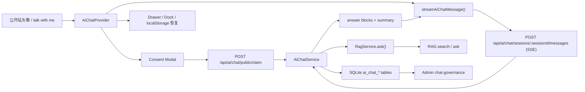
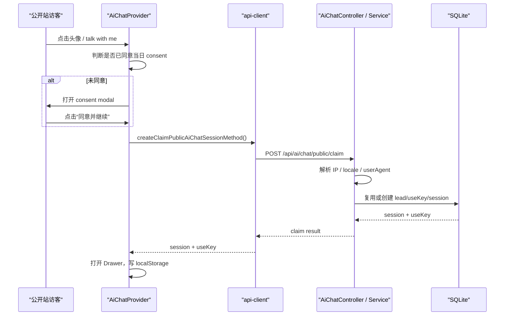
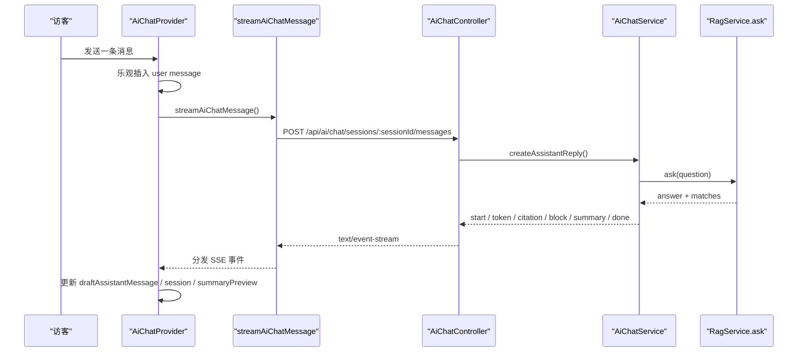
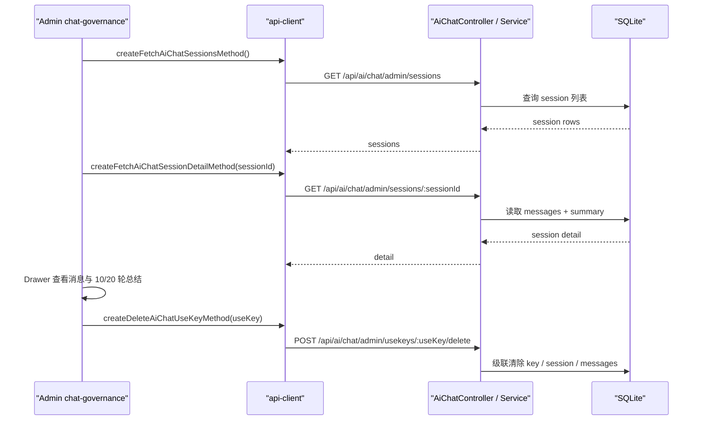

# M23 AI Chat：流式对话、全局 Drawer 与治理闭环源码梳理

这篇文档只聚焦 `M23` 这一条主线：

`公开站头像入口 -> consent -> public claim -> 全局 Drawer -> SSE 流式问答 -> SQLite 持久化 -> Admin 治理台`

它适合在你已经知道“AI Chat 能用了”之后再读。目标不是告诉你页面长什么样，而是帮你回答：

- 这条链路到底由哪些模块组成？
- 为什么入口做成全局 Drawer，而不是继续做 `/ai-talk/chat` 独立页面？
- SSE、会话恢复、summary、治理台在代码里分别落在哪里？
- 现在怎样分层验证它真的跑通了？

## 一、这条链路解决了什么问题

在这轮实现之前，公开站里的 `ai-talk` 更像一个占位式入口：

- 有信息架构
- 有后续规划
- 但没有真实问答闭环

问题不在于“页面还不够漂亮”，而在于它还不具备一个真实 AI 入口该有的最小五脏六腑：

1. 用户能从公开站任意页面进入
2. 对话可以流式返回
3. 会话能恢复，而不是刷新就丢
4. 会话和额度有最小治理边界
5. 管理员能回看和删除记录

所以这轮的目标不是做一个“大而全的 AI 中台”，而是先把公开站 AI 能力收成一个真实 MVP：

> 可交互、可恢复、可治理、可回看。

## 二、整体架构图



如果只用一句话解释这张图：

> Web 端负责入口、状态和恢复；`packages/api-client` 负责流式协议消费；`server ai/chat` 负责会话与总结编排；RAG 只作为问答底座被复用；Admin 负责治理视角。

## 三、三条最值得先看懂的时序

### 1. 头像点击 -> consent -> 会话认领 -> Drawer 打开



这条时序最关键的设计点有两个：

1. 公开站不先要求用户理解 `useKey`
2. `IP + 当天日期` 被用作最小公开会话边界

这让首屏门槛足够低，但又没有完全丢掉治理抓手。

### 2. 发送消息 -> SSE token/block/summary/done -> 前端状态更新



前端不是等服务端一次性返回整条 assistant message，而是边收边拼：

- `start`：建立 assistant 草稿消息壳
- `token`：往正文尾部追加文本
- `citation`：追加来源引用
- `block`：追加结构化展示块
- `summary`：更新 10/20 轮总结预览
- `done`：用最终 session 快照替换前端状态
- `error`：停止流并展示错误

### 3. Admin 查看会话详情 -> 回看总结 -> 删除 useKey



这一条链路体现的不是“用户体验”，而是：

> 同一个公开站 AI 能力，必须同时具备运营可见性和最低限度的治理能力。

## 四、按子系统看实现

### 1. Server：会话编排、持久化与总结节点

关键入口：

- `apps/server/src/modules/ai/transport/controllers/ai-chat.controller.ts`
- `apps/server/src/modules/ai/chat/ai-chat.service.ts`
- `apps/server/src/modules/ai/chat/ai-chat.repository.ts`
- `apps/server/src/modules/ai/chat/ai-chat-bootstrap.service.ts`
- `apps/server/src/database/schema.ts`

#### 表结构在承载什么

当前新增的 `ai_chat_*` 表不是为了“做数据库设计秀”，而是分别承担不同职责：

- `ai_chat_visitor_leads`
  - 访客线索入口
  - 记录公开站来访者与来源键
- `ai_chat_usekeys`
  - 管理当日访问资格、状态与轮次上限
- `ai_chat_sessions`
  - 记录会话状态、轮次、阶段总结、最终总结
- `ai_chat_messages`
  - 记录 user / assistant / system 消息流与 answer blocks

这样拆开后，`lead / useKey / session / messages` 四个层级各有边界，Admin 才能从不同视角治理。

#### 为什么要启动补表

`AiChatBootstrapService` 的存在不是“多此一举”，而是因为项目当前仍是教程型渐进演进：

- 旧 SQLite 库可能没有这些新表
- 有些表可能有表，但缺新列
- 如果直接依赖静态 schema，而不在启动时补齐，服务会在启动阶段就挂掉

所以这里用了一个很务实的策略：

> 先让新能力能在旧库上安全起来，再考虑更完整的迁移体系。

这特别适合当前项目阶段。

#### 为什么复用 `RagService.ask()`

在 `AiChatService.createAssistantReply()` 里，公开站问答并没有再造一套搜索与回答链路，而是直接复用 `RagService.ask()`。

这么做有几个好处：

1. 避免公开站和既有 RAG 主线分叉
2. 复用现有 citations 和问答边界
3. 让后续 RAG 质量优化能直接反哺 AI Chat

也就是说，AI Chat 是一个“产品入口层”，不是一套独立知识问答引擎。

#### 总结节点为什么放在 10 / 20 轮

在 `AiChatService` 里，总结不是每轮都生成，而是在：

- `turn-10`
- `turn-20`

这样做的原因很直接：

- 每轮总结会让成本和复杂度都快速上升
- 10 轮适合做阶段总结
- 20 轮适合做最终总结并关闭会话

这是一种很典型的教程型产品取舍：

> 先选两个确定节点，让“总结能力”真正产生价值，而不是到处点缀。

### 2. API Client：SSE 协议与 facade 约束

关键文件：

- `packages/api-client/src/ai.ts`
- `packages/api-client/src/types/ai.types.ts`
- `packages/api-client/src/ai.spec.ts`

#### `streamAiChatMessage` 做了什么

`streamAiChatMessage()` 做的事其实很纯粹：

1. 发起 `POST /api/ai/chat/sessions/:sessionId/messages`
2. 读取 `ReadableStream`
3. 按 SSE 报文分帧
4. 解析 `event:` 和 `data:`
5. 分发给调用方 handler

它不是业务层，而是协议消费层。

#### SSE 事件类型

当前这条流至少包括：

- `start`
- `token`
- `citation`
- `block`
- `summary`
- `done`
- `error`

每一种事件都不只是“为了炫流式”，而是服务不同 UI 更新目的：

- `token` 让正文逐字增长
- `citation` 让来源提示可追溯
- `block` 让结构化卡片单独渲染
- `summary` 让阶段总结能即时浮现在前端
- `done` 用服务端最终 session 快照收口

#### 为什么仍然用 `fetch + ReadableStream`

这里没有引入额外的 EventSource 封装或重型 SDK，而是继续沿用既有的 `fetch + ReadableStream` 模式，原因有三个：

1. 与现有简历导入 SSE 思路统一
2. 测试成本更低，`packages/api-client` 层更好 mock
3. 更贴合当前“Method-first + 手动消费流”的工程风格

### 3. Web：全局状态、会话恢复与 Drawer / Dock 体验

关键文件：

- `apps/web/app/_shared/ai-chat/ai-chat-context.tsx`
- `apps/web/app/_shared/ai-chat/ai-chat-drawer.tsx`
- `apps/web/app/_shared/ai-chat/ai-chat-dock.tsx`
- `apps/web/app/_shared/ai-chat/ai-chat-message-list.tsx`
- `apps/web/app/[locale]/_resume/published-resume-hero.tsx`

#### `AiChatProvider` 是这条线的前端中枢

`AiChatProvider` 不是一个简单容器，它承担了 5 件事：

1. 管理全局 Drawer 可见性
2. 管理 consent / chat / closed 视图状态
3. 管理当前 session 与 `useKeyStatus`
4. 管理流式中的 assistant 草稿消息
5. 管理本地会话恢复

这就是为什么 AI Chat 被做成“站点级能力”，而不是某个页面里的局部组件。

#### 三种主要视图状态

当前前端核心状态可以抽成三个用户可感知视图：

- `consent`
  - 先同意公开站最小隐私提示
- `chat`
  - 正常多轮对话
- `closed`
  - 会话关闭后展示总结与回看入口

而 `AiChatProvider` 内部还会处理：

- `loading`
- `bootstrapping`
- `streaming`
- `minimized`

这些是体验状态，不直接暴露成单独页面。

#### `localStorage` 恢复做了什么

当前 localStorage 主要存：

- `consentDay`
- `consentPolicyVersion`
- `sessionId`
- `useKey`

这样刷新后，前端可以主动调用 `createFetchAiChatSessionMethod()` 恢复会话，而不是丢失上下文。

这一步的价值特别高，因为它把“公开站临时体验”往“真实产品体验”推了一步。

#### Drawer 为什么最小化成 Dock

关闭 Drawer 后不是直接销毁，而是收成右下角 Dock，原因是：

- 公开站聊天是一种跨页面辅助体验
- 用户可能只是暂时收起，而不是彻底放弃会话
- 保留 Dock 能让“继续聊”比“重新找入口”更自然

### 4. Admin：治理台不是聊天 UI，而是运营视角

关键文件：

- `apps/admin/app/[locale]/dashboard/ai/chat-governance/_chat-governance/chat-governance-shell.tsx`
- `apps/admin/app/[locale]/dashboard/ai/_ai/ai-workbench-shell.tsx`

#### `chat-governance` 页面在看什么

当前治理台主要提供三种视角：

1. `leads`
   - 谁触发过这条公开 AI 入口
2. `useKeys`
   - 哪些资格被发放、认领、作废
3. `sessions`
   - 会话状态、轮次、更新时间、详情

对当前 MVP 来说，这已经够支撑两个关键动作：

- 回看真实会话质量
- 清理或删除问题会话

#### 为什么说它是“最小治理”，不是复杂运营后台

当前治理台故意没有做：

- 多维筛选面板
- 大量统计图
- 深度风控配置
- 复杂标签系统

因为这轮要解决的是：

> 至少能看、能删、能确认 summary 是否生成。

这已经是一个合格的最小治理闭环。

## 五、关键设计取舍

### 1. 为什么做成全局 Drawer，而不是继续优先 `/ai-talk/chat`

因为用户真正的使用场景是“我正在看简历内容，突然想问一句”，而不是“我愿意先离开当前页面，专门进入一个聊天路由”。

所以全局 Drawer 是把 AI 能力收成“随时可用的辅助层”，而不是“另一个页面”。

### 2. 为什么公开站 MVP 不先让用户输入 useKey

因为 `useKey` 是治理模型，不应该先成为公开站产品门槛。

治理可以存在，但不需要先压在首屏上。  
当前做法是：

- 后端保留 `lead / useKey / session`
- 前端先用 `consent + public claim` 进入

这是体验优先、治理保底的折中方案。

### 3. 为什么会话计数按“用户提问轮次”

因为这比按 assistant 消息数更稳定，也更符合产品理解。

用户最容易感知的是：

> 我还能问几次？

而不是：

> 系统刚刚写入了几条消息？

### 4. 为什么第 10 / 20 轮才做 summary

因为 summary 应该是“有节点意义的浓缩”，而不是每轮都插入的噪声。

10 轮前后：
- 更适合阶段总结

20 轮结束：
- 更适合最终总结与会话收尾

### 5. 为什么 answer blocks 首版只做 `project_card / experience_card`

因为这两类信息最适合简历问答场景：

- 项目卡片
- 经历卡片

它们比“把所有内容都卡片化”更容易带来真实价值，也更容易控制实现复杂度。

## 六、分层验证清单

这部分不是“将来可以补”，而是这条主线当前就应该怎么验证。

### 1. 类型 / API Client 层

**验证目的**

- 确认 AI Chat 契约完整
- 确认 SSE 事件能被正确消费和分发

**推荐命令 / 入口**

```bash
pnpm --filter @my-resume/api-client test -- src/ai.spec.ts
```

**预期现象**

- `streamAiChatMessage` 能解析 `start / token / citation / block / summary / done / error`
- `public claim / fetch session / close session` 契约通过

**失败时优先排查点**

- `packages/api-client/src/ai.ts`
- `packages/api-client/src/types/ai.types.ts`
- SSE 报文格式是否仍与 server 对齐

### 2. Server 行为层

**验证目的**

- 确认公开站会话认领、流式回答、summary 持久化的主链路没有断

**推荐命令 / 入口**

```bash
pnpm --filter @my-resume/server typecheck
```

补充：

- 当前下一阶段最值得补的测试专项，是 `AiChatService / Controller` 的单测与 SSE 行为测试。

**预期现象**

- `POST /api/ai/chat/public/claim` 能创建或恢复会话
- `POST /api/ai/chat/sessions/:sessionId/messages` 能以 `text/event-stream` 输出事件
- 第 10 / 20 轮后能在 session 上看到 `interimSummary / finalSummary`

**失败时优先排查点**

- `apps/server/src/modules/ai/chat/ai-chat.service.ts`
- `apps/server/src/modules/ai/transport/controllers/ai-chat.controller.ts`
- `apps/server/src/database/schema.ts`
- 启动补表顺序是否破坏了旧库兼容

### 3. Web 交互层

**验证目的**

- 确认公开站从头像点击到 Drawer / Dock 恢复的整条体验链路成立

**推荐命令 / 入口**

```bash
pnpm --filter @my-resume/web test -- 'app/_shared/ai-chat/__tests__/ai-chat-context.spec.tsx' 'app/_shared/ai-chat/__tests__/ai-chat-drawer.spec.tsx'
pnpm --filter @my-resume/web typecheck
```

**手工验证**

1. 打开公开站简历页
2. 点击头像或 `talk with me ...`
3. 出现 consent modal
4. 点击“同意并继续”
5. Drawer 打开并进入对话
6. 关闭 Drawer 后变成 Dock
7. 点击 Dock 后恢复
8. 刷新页面后能恢复当日会话

**失败时优先排查点**

- `apps/web/app/_shared/ai-chat/ai-chat-context.tsx`
- localStorage 读写逻辑
- `emitGlobalAiChatOpen()` 是否触发
- `fetch session` 与 `claim session` 的分支判断是否跑偏

### 4. Admin 治理层

**验证目的**

- 确认治理台能看到公开站会话，并能回看总结与删除 useKey

**推荐入口**

- 页面：`/dashboard/ai/chat-governance`

**预期现象**

- 能看到 `leads / useKeys / sessions`
- 能查看 session detail
- 能看到第 10 / 20 轮 summary
- 删除 useKey 后，访客再次进入会重新认领

**失败时优先排查点**

- `apps/admin/app/[locale]/dashboard/ai/chat-governance/_chat-governance/chat-governance-shell.tsx`
- 详情 Drawer 读取逻辑
- 删除 useKey 的级联清理是否完整

## 七、当前边界与下一步

当前这条线已经是一个真实可用的公开站 MVP，但它还不是完整 AI 产品。

### 当前边界

- 公开站入口优先服务“快速试聊”
- 治理台只做最小回看与清理
- 仍然强依赖底层 `RagService.ask()` 质量
- summary 只在固定节点触发
- 尚未提供更强的策略化治理能力

### 下一步自然演进点

1. 更强的 server 单测与 SSE 行为测试
2. 会话检索、过滤与审计增强
3. 更显式的策略面板与安全门控
4. 更丰富的 answer blocks
5. 数字人 / 多模态入口与当前 Drawer 形态的衔接

如果只记一句话，可以这样总结这轮：

> 这不是“又做了一个聊天页面”，而是把公开站 AI 入口真正收成了一条可用、可恢复、可治理的产品链路。
